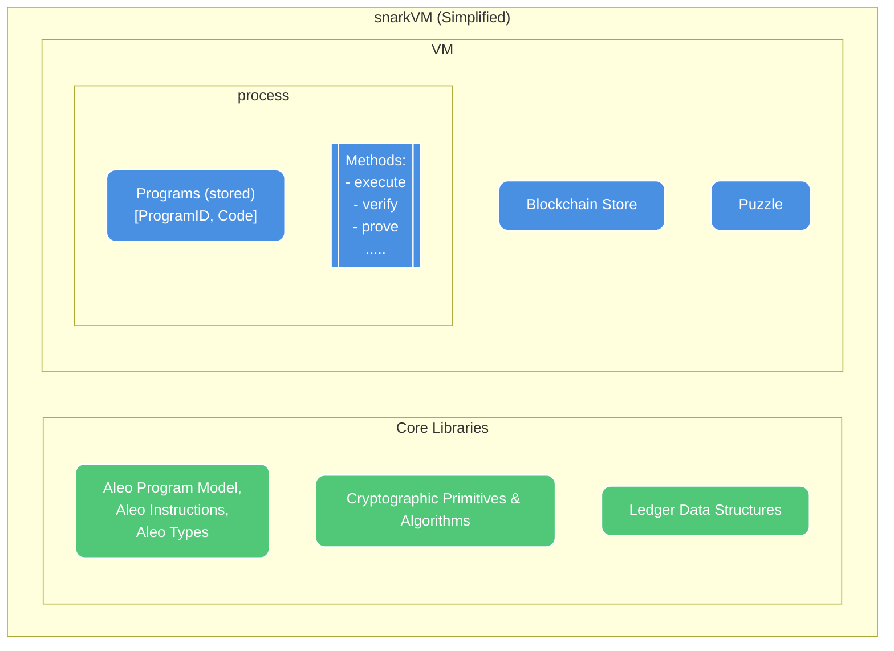

Building private web applications with the SDK requires a few fundamental pieces of knowledge about how Aleo enables
privacy. This guide introduces these concepts and provides on overview of the core building blocks of a "private app".

# What is Aleo? How does it enable privacy?

Aleo is composed of independent software packages that work together to build a suite of privacy tools and a layer 1 
blockchain network that natively supports private programs.

## 1. snarkVM

snarkVM is a zero knowledge virtual machine that supports running executable programs that can have private inputs or 
outputs, allowing programs to be run privately, producing a proof that the execution was run correctly without revealing
the private inputs or outputs. These proofs can be verified by any party, with the most common verifier being the Aleo
Blockchain.

snarkVM provides for tools building these programs, executing them with snarkVM, verifying their execution. It also 
provides cryptographic primitives that developers can use to build their own privacy and encryption schemes outside of 
the VM.

These tools can be used to build private applications both on and off the Aleo Network. A deeper dive into snarkVM can 
be found in the section [How does Aleo Enable Privacy?](99_apendix.md).

## 2. SnarkOS & the Aleo Network

