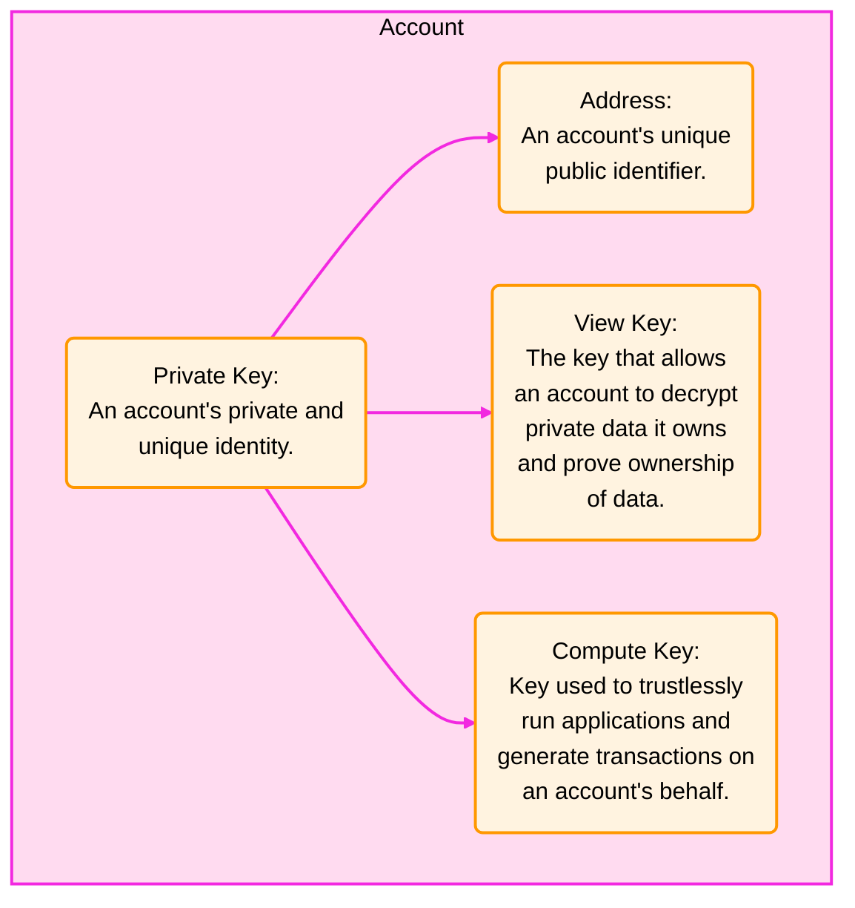

An Aleo account is defined as a Private Key, and several other cryptographic keys derived from the private key. 

## Account Keys

### Private Key
The `Private Key` can be thought of as the core identity of a user. It is the most sensitive of the keys within an Aleo 
account and is used to derive all other keys. It is used to sign and create new program executions, to encrypt & decrypt
private data within a zero knowledge function execution, and to generate signatures, commitments, and other key material 
used in zero-knowledge proofs.

### View Key
The `View Key` is derived from the private key and can be used to both decrypt encrypted data owned by a user and prove
ownership of that data. Specific usages of this key include, determining ownership of records, decrypting records,
and decrypting private inputs or outputs of a zero-knowledge program generated by the owner of the private key.

### Compute Key
The `Compute Key` can be used to trustlessly run applications and generate transactions on a user's behalf.

### Address
The `Address` is a user's unique public identifier. It serves as an address for a user to receive both Aleo credits and 
data from other zero-knowledge Aleo programs.



Please note that all keys are considered sensitive information and
should be stored securely.

## Creating an Account

All keys can be created using the account object. 

```typescript
import { Account } from '@provablehq/sdk';

const account = new Account();

// Individual keys can be then be accessed through the following methods
const privateKey = account.privateKey();
const viewKey = account.viewKey();
const computeKey = account.computeKey();
const address = account.address();
```

Alternatively, an account can be created with an existing private key:
```typescript
import { Account } from '@provablehq/sdk';
import { PrivateKey } from './wasm';

// From a newly generated private key
const privateKey = new PrivateKey();
const account = new Account({ privateKey });

// From a private key derived from its string representation
const privateKey2 = PrivateKey.fromString('APrivateKey1...');
const account2 = new Account({
    privateKey: privateKey2,
});

// From a private key string
const account3 = new Account({
    privateKey: 'APrivateKey1...',
});
```

Or an encrypted ciphertext of the private key:
```typescript
import { Account } from '@provablehq/sdk';
import { PrivateKey } from './wasm';

// From a newly generated encrypted private key
const password = 'password';
const ciphertext = PrivateKey.newEncrypted(password);
const account = Account.fromCiphertext(ciphertext, password);

// From the encryption of an existing private key
const privateKey = PrivateKey.fromString('APrivateKey1...');
const existingPassword = 'existingPassword';
const existingCiphertext = privateKey.toCiphertext(existingPassword);
const existingAccount = Account.fromCiphertext(existingCiphertext, existingPassword);
```