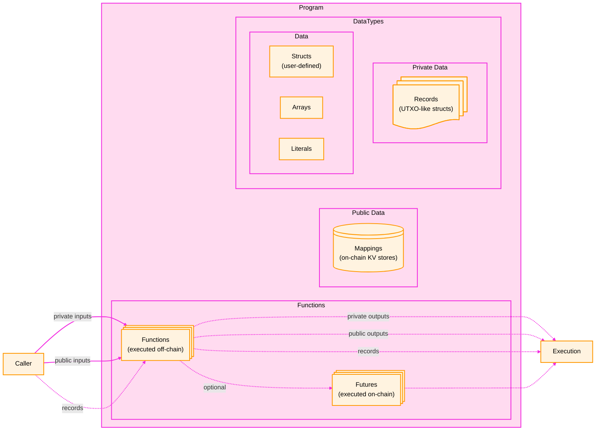
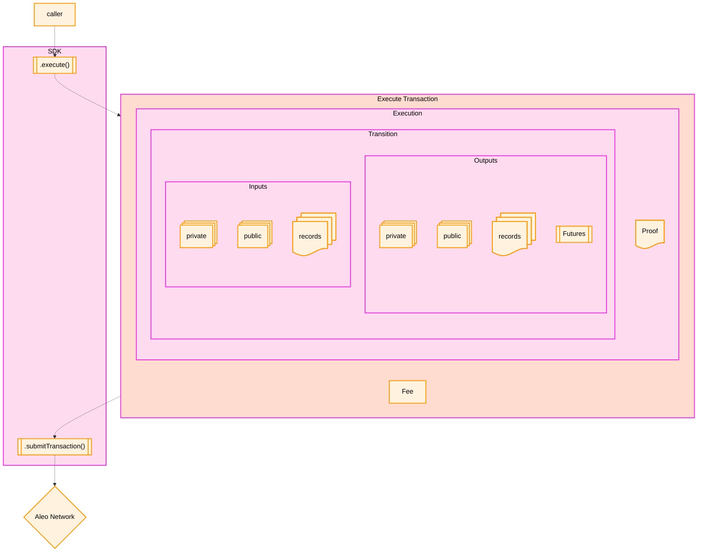

## Programs

### Overview

Programs lie at the core of the Aleo protocol. Programs are collections of functions, private records, data structure 
definitions and on-chain public datastores.



Program functions can have private inputs or outputs. When a function is executed, the output is:
1. A proof that the function was executed correctly.
2. A list of `Transitions` which enumerate the following
   - **Public Inputs/Outputs:** A list of public inputs/outputs
   - **Encryped Private Input/Outputs:** A list of encrypted private inputs/outputs that is 
   only decryptable by the holder of private key (or view key) of the user who executed the program.
   - **Records:** Special, encrypted UTXO-like structs that store longterm private state.
   - **Futures:** Any optional code marked as a future to be executed on chain later

The `Transitions` provide useful information on the function execution and its inputs & outputs, and the proof provides 
certainty that the function was executed correctly. This allows outside verifiers to trust that the private inputs and 
outputs are correct without the need to see them. This is the core of the Aleo protocol's privacy guarantees as it 
allows for fully private execution of programs. 

### Lifecycle of an Execution

When a function is executed within the Provable SDK, it is executed locally and when the execution finishes, the SDK 
wraps the execution in an `Execution Transaction` and submits it to the Aleo network. Once the Aleo network receives,
it is verified by the network's validators. If the transaction is valid and has the required fee, it is added to
the ledger in a block which updates the state of the program.


### Aleo Programming Languages

Programs on Aleo are written in one of two languages:
1. [Leo](https://docs.leo-lang.org/leo/language): A high-level, developer-friendly language for developing zero-knowledge programs.

2. [Aleo Instructions](https://docs.leo-lang.org/aleo/language): A low-level language that provides developers with fine-grained control over the execution
   flow of zero-knowledge programs. Leo code is compiled into Aleo Instructions under the hood.

Documentation for both languages can be found at [docs.leo-lang.org](https://docs.leo-lang.org/). 

Those interested in attempting to build programs immediately should visit the Leo Playground at 
[playground.leo-lang.org](https://playground.leo-lang.org/).

#### "Hello World" in Leo
```
// A simple program adding two numbers together
program helloworld.aleo {
  transition hello(public a: u32, b: u32) -> u32 {
      let c: u32 = a + b;
      return c;
  }
}
```

#### "Hello World" in Aleo Instructions
```
program helloworld.aleo;

// The Leo code above compiles to the following Aleo Instructions:
function hello:
    input r0 as u32.public;
    input r1 as u32.private;
    add r0 r1 into r2;
    output r2 as u32.private;
```

## Transactions

Transactions are the primary method of updating the state of the Aleo Network. There are two types of transactions in Aleo:

### Execution Transactions
As discussed in the Programs section above, an Execution Transaction contains the following
* A proof of execution that one or more Aleo Programs were executed correct
* A set of `Transitions` which list the inputs and outputs of the function executions
* A fee that is paid to the network for the transaction.

Execution transactions update the state of the ledger, and update the internal state of the programs that were executed.

State is updated in one of two ways:
1. **Public State:** If a function contains a **future**, the future is executed on-chain by the validators and the 
public mappings (an on-chain key-value store associated with a program).
2. **Private State:** If a function takes a record as input, that record is "spent". If a function returns a record as
output, a new record is created and stored in the Block and can be used as input in future transactions.

### Deployment Transactions
Transactions which add a new program to the Aleo chain (with blank state). Once programs are deployed, execution 
transactions can be sent that change the state of the program and the Aleo ledger.

### Lifecycle of a Transaction

The following diagram shows the lifecycle of a transaction in the Aleo network.



## Building Transactions with the SDK

The SDK provides the ability to both build transactions and submit them to the Aleo network. It also allows for the 
inspection of the data in existing transactions or programs so that data on-chain can be used within a front or backend 
application. The following sections will provide an overview of how to build both transfers of both Aleo credits, 
arbitrary programs, and how to build and deploy new programs.