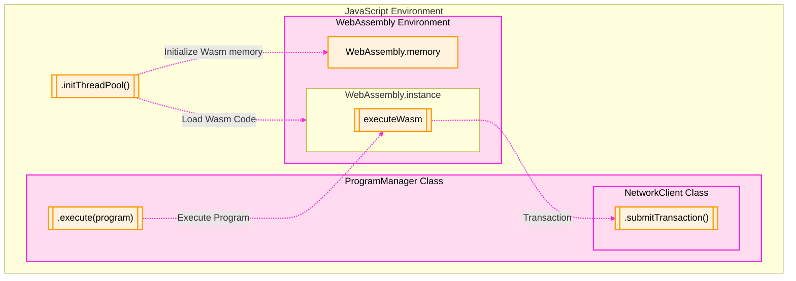
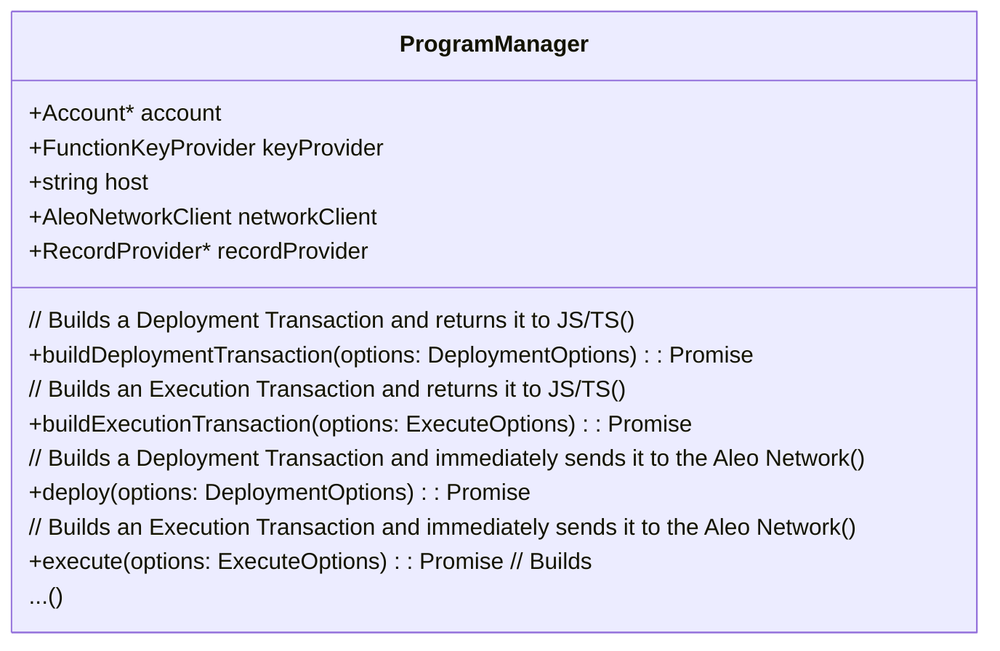

The Provable SDK provides the ability to build `Execution transactions` locally and submit them to the Aleo Network.

The `ProgramManager` class encapsulates the functionality for executing programs and building `Execution Transactions`. 
The ProgramManager calls code from [SnarkVM](https://github.com/ProvableHQ/SnarkVM) that has been compiled into WebAssembly.
This code runs the execution, creates the resulting transitions and the ZkSnark proof of the execution within the 
local WebAssembly environment and returns an `Execution Transaction` when it is finished. Once the transaction is built,
it is submitted to the Aleo network using the `NetworkClient` class.

This process is visualized within the following diagram. The necessary steps to perform these actions within JavaScript
or Typescript are explained in this guide.



## 1. WebAssembly Initialization
Before being able to utilize `WebAssembly` it must be initialized within the Browser or Node environment. This is done
by calling `initThreadPool` function which initializes `wasm` memory and creates a `wasm` instance which can take 
advantage of multiple available threads on the host machine.

```typescript
import { Account, initThreadPool } from '@provablehq/sdk/mainnet.js';

// Enables multithreading
await initThreadPool();

// Create a new Aleo account
const account = new Account();

// Perform further program logic...
````

This step MUST
1. Be performed before any other operations are executed. 
2. Be performed only once per for the entire application lifecycle. **Do not call `initThreadPool` multiple times.**

### 2 Building an Execution Transaction
The `ProgramManager` class has multiple convenience methods for building `Execution` and `Deployment` transactions. 
Shown below is a partial class diagram of the `ProgramManager` class introducing the methods that are used to build 
general execution and deployment transactions.



There are two main methods for building general execution transactions: `execute` and `buildExecutionTransaction`. 
Calling `execute` will build and submit the transaction to the Aleo network, while `buildExecutionTransaction` will
only build the transaction and return it to the caller within Javascript.

'
```typescript
import { Account, AleoNetworkClient, NetworkRecordProvider, ProgramManager, AleoKeyProvider } from '@provablehq/sdk';

// Create an account
const account = new Account();

// Create a network client to connect to the Aleo network
const networkClient = new AleoNetworkClient("https://api.explorer.provable.com/v1");

// Create a key provider that will be used to find public proving & verifying keys for Aleo programs
const keyProvider = new AleoKeyProvider();
keyProvider.useCache = true;

// Create a record provider that will be used to find records and transaction data for Aleo programs
const recordProvider = new NetworkRecordProvider(account, networkClient);

// Initialize a program manager to talk to the Aleo network with the configured key and record providers
const programManager = new ProgramManager("https://api.explorer.provable.com/v1", keyProvider, recordProvider);

// Set the account for the program manager
programManager.setAccount(account);

(async () => {
    try {
        // Provide a key search parameter to find the correct key for the program if they are stored in a memory cache
        const keySearchParams = { cacheKey: "helloworld.aleo:main" };
        console.log("Key search parameters set: ", keySearchParams);

        // Execute the program using the options provided inline
        const tx_id = await programManager.execute({
            programName: "helloworld.aleo",
            functionName: "main",
            fee: 0.020,
            privateFee: false, // Assuming a value for privateFee
            inputs: ["5u32", "5u32"], // Example inputs matching the function definition
            keySearchParams: keySearchParams,
            privateKey: account.privateKey() // Set the private key
        });
        const transaction = await programManager.networkClient.getTransaction(tx_id);
        console.log("Transaction details: ", transaction);
    } catch (error) {
        console.error("Error executing program:", error);
    }
})();
```

A reader of the above example may notice the `RecordProvider` and `KeyProvider` classes that were not present in the local
execution example. The `KeyProvider` class helps users of the SDK find `Proving Keys` for programs. `Proving Keys`
allow zero-knowledge proofs that the programs were executed correctly to be created. The `RecordProvider` class helps
find `Records` which are private data associated with programs that can be changed and updated throughout time.
These two concepts are explained in more detail below.

## 3. Local program execution

A simple example of running the "hello world" program locally using Node.js and capturing its outputs is shown below:
```typescript
import { Account, ProgramManager } from '@provablehq/sdk';

/// Create the source for the "hello world" program
const program = "program helloworld.aleo;\n\nfunction hello:\n    input r0 as u32.public;\n    input r1 as u32.private;\n    add r0 r1 into r2;\n    output r2 as u32.private;\n";
const programManager = new ProgramManager();

/// Create a temporary account for the execution of the program
const account = new Account();
programManager.setAccount(account);

/// Get the response and ensure that the program executed correctly
const executionResponse = await programManager.run(program, "hello", ["5u32", "5u32"]);
const result = executionResponse.getOutputs();
assert.deepStrictEqual(result, ['10u32']);
```