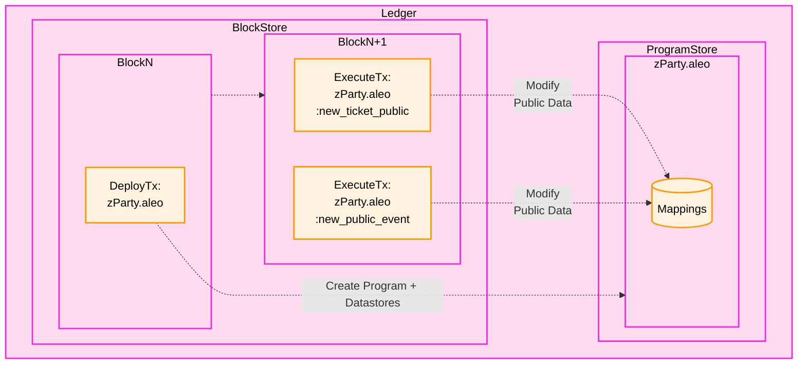

Mappings are simple key-value stores defined in a program. Mappings within programs are identified by the `mapping` 
identifier. Any program where this keyword appears contains an on-chain mapping. Each mapping has a key and value, each
with an Aleo type specified by the author of the program.

```
// Account mapping in credits.aleo. This mapping 
// stores all public Aleo credits balances on-chain
mapping account:
    key owner as address.public;
    value microcredits as u64.public;
```

When program `Deployment Transaction` is accepted into a 
block, these key-value stores are initialized within RocksDB stores in the Aleo Ledger. After deployment program 
mappings can be updated by executing Aleo functions that contain a `finalize` block.



## Initializing & updating mappings
Updating mappings is done by executing a program function on the Aleo network which has a finalize block that updates the
program's mapping. For instance, the `transfer_public` function in the `credits.aleo` program updates the `account`
mapping (and thus a user's balance) when called.

```
mapping account:
    key owner as address.public;
    value microcredits as u64.public;

// The public interface called by users
function transfer_public:
    input r0 as address.public;
    input r1 as u64.public;
    async transfer_public self.caller r0 r1 into r2;
    output r2 as credits.aleo/transfer_public.future;

// The finalize block run by nodes on the Aleo network which update a user's public balance
finalize transfer_public:
    input r0 as address.public;
    input r1 as address.public;
    input r2 as u64.public;
    get account[r0] into r3;
    sub r3 r2 into r4;
    set r4 into account[r0];
    get.or_use account[r1] 0u64 into r5;
    add r5 r2 into r6;
    set r6 into account[r1];
```

The `finalize` identifier is used to identify a portion of a function's code that should be executed by nodes on the 
Aleo network. Program mappings are updated exclusively by code run by nodes on the Aleo network written in `finalize` 
blocks. 

### Updating Mappings with the SDK

Updating mappings requires executing an Aleo function that has a `finalize` block which updates the mapping. If the
inputs to the function are valid and the correct fee is paid, the network will execute the function and update the mapping.
If function inputs are invalid or an invalid fee is paid, the network will return an error, but the fee paid for the 
transaction will still be consumed. Therefore, it is important to ensure the fee and inputs are correct before executing.

A simple example of a mapping update can be shown by simply executing `transfer_public` as shown below.

```typescript
import { Account, ProgramManager, AleoKeyProvider, NetworkRecordProvider, AleoNetworkClient } from '@provablehq/sdk';

// Create a new NetworkClient, KeyProvider, and RecordProvider
const account = Account.from_string({privateKey: process.env.PRIVATE_KEY});
const networkClient = new AleoNetworkClient("https://api.explorer.provable.com/v1");
const keyProvider = new AleoKeyProvider();
const recordProvider = new NetworkRecordProvider(account, networkClient);

// Initialize a program manager with the key provider to automatically fetch keys for executions
const RECIPIENT_ADDRESS = "aleo1address...";
const programManager = new ProgramManager("https://api.explorer.provable.com/v1", keyProvider, recordProvider);
programManager.setAccount(account);

// Update or initialize a public balance
const tx_id = await programManager.transfer(1, RECIPIENT_ADDRESS, "transfer_private_to_public", 0.2);
```

## Reading mappings
Any state within a program mapping is public and can be read by any participant in the Aleo network. 

### Discovering available mappings
The `NetworkClient` class provides the `getProgramMappingNames` method to read the public mappings available within a program.

```typescript
import { AleoNetworkClient } from '@provablehq/sdk';

const networkClient = new AleoNetworkClient("https://api.explorer.provable.com/v1");
const creditsMappings = networkClient.getProgramMappingNames("credits.aleo");
assert(creditsMappings === ["committee", "delegated", "metadata", "bonded", "unbonding", "account", "withdraw"]);

const publicCredits = networkClient.getMapping("credits.aleo", "[a valid aleo account with zero balance]");
assert(publicCredits === "0u64");
```

### Reading a mapping
The `getProgramMappingValue` method of the `NetworkClient` can be used to read the value of a key in a mapping. The method 
returns the value associated with the specified key within the mapping or an `Error` if the key does not exist.

```typescript
import { AleoNetworkClient } from '@provablehq/sdk';

const networkClient = new AleoNetworkClient("https://api.explorer.provable.com/v1");
const publicCredits = networkClient.getProgramMappingValue("credits.aleo", "aleo1address...");
assert(publicCredits === "437059431396u64");
```