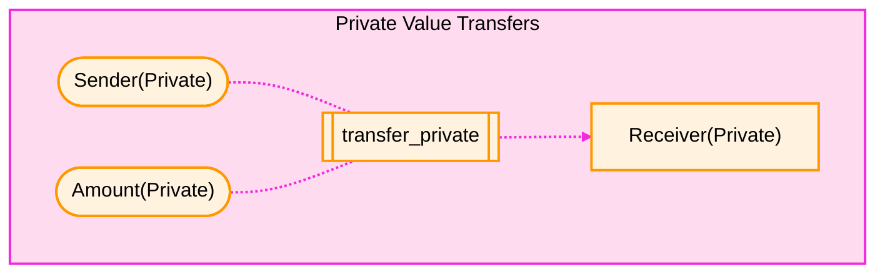
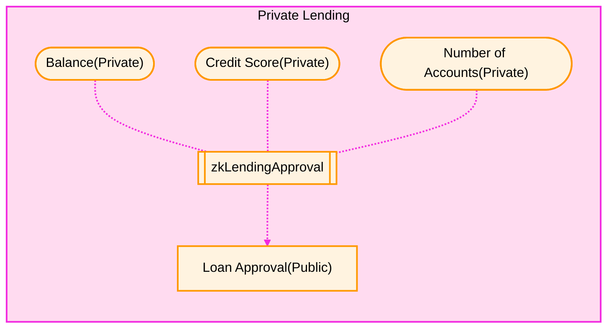
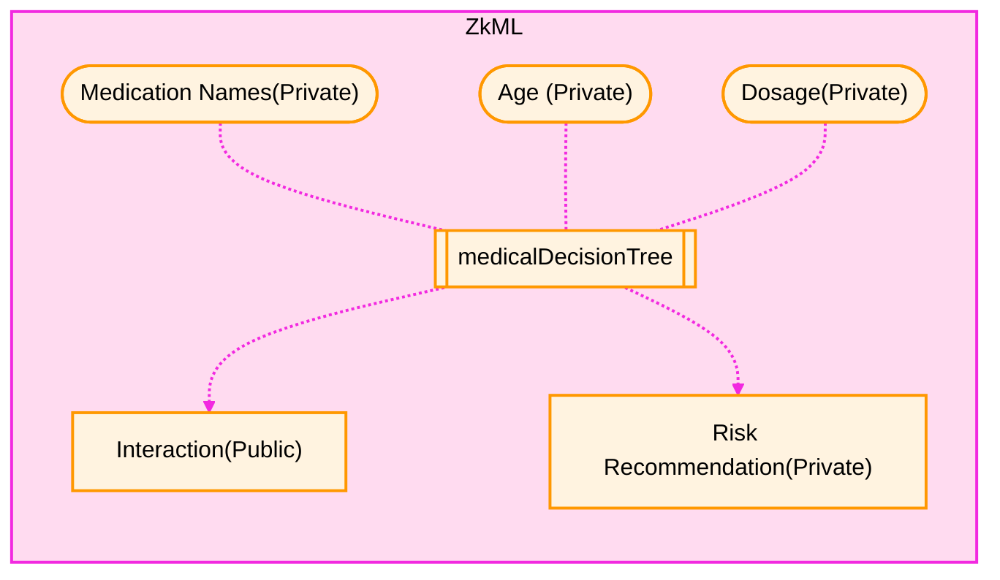
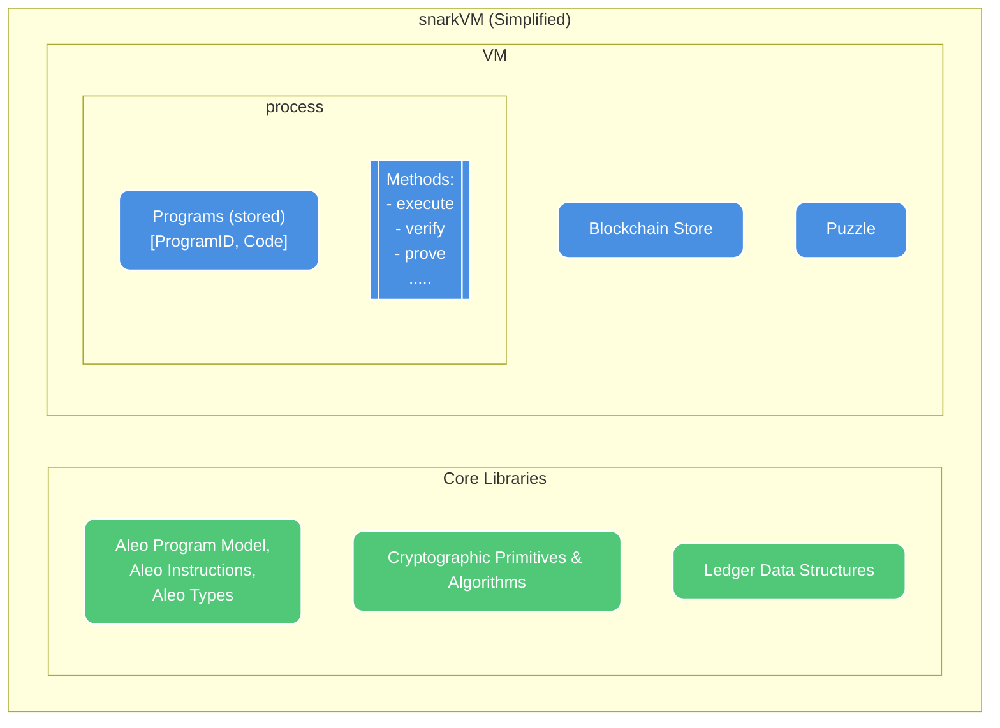

Building private web applications with the SDK requires a few fundamental pieces
of knowledge about how Aleo enables privacy. This guide introduces these
concepts and provides on overview of the core building blocks of a "private
app".

# How does Aleo Create Privacy?

Aleo enables private apps through the use of `function privacy`. Functions
executed on Aleo can have private inputs or outputs and generate persistent
private state.

Program functions can have private inputs or outputs that are only visible to
the caller of the function (and in some cases, an intended receiver) and
encrypted for everyone else. This paradigm allows for building privacy
preserving protocls such as private transfers of assets, lending approvals which
do not require the lender to know the borrower's assets, private machine
learning inferences, and more.

# What is Aleo?

Aleo is composed of two main components which are used and operated by the
`Aleo` community.

## SnarkVM - The Aleo zkVM

A zkVM called `snarkVM` which provides private Program execution via the Varuna
zkSnark as well and several libraries of cryptographic primitives such as hash
functions, field & elliptic curve arithmetic, and symmetric encryption tools.

`snarkVM` supports running executable programs that can have private inputs or
outputs, allowing programs to be run privately, producing a proof that the
execution was run correctly without revealing the private inputs or outputs.
These proofs can be verified by any party, with the most common verifier being
the Aleo Blockchain.

## The Aleo Blockchain

A blockchain network operated through community operated `SnarkOS` nodes which
provide a decentralized network for executing private programs. The network is
secured by independent `validators` via a proof of stake consensus mechanism
called `Bullshark` that allows anyone to join or leave the validator set. An
audit and description of Aleo Bullshark can found in the
[Aleo Bullshark Audit](https://docs.leo-lang.org/sdk/audit/bullshark) by
zkSecurity.

# Building Private Programs on Aleo

### Build & Use Private Programs with the Leo Language and Provable SDK

Developers can build their own private programs and deploy them to the `Aleo`
network through the usage of the [Leo language](https://docs.leo-lang.org/leo).
Leo is a high-level, developer-friendly language for developing zero-knowledge
programs.

Developers can execute and interact with private programs via the
`Provable SDK`. The `Provable SDK` provides methods for executing programs and
interacting with public and private state on the `Aleo Network`. This guide
provides a detailed overview of how to use the `Provable SDK` to build private
full stack web applications.
