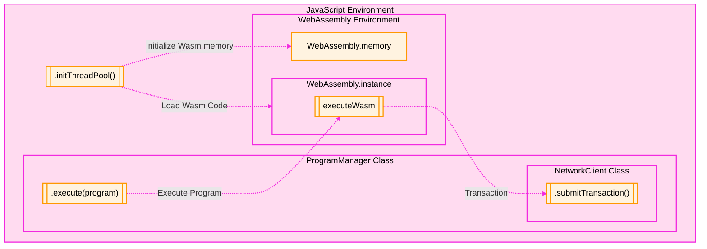
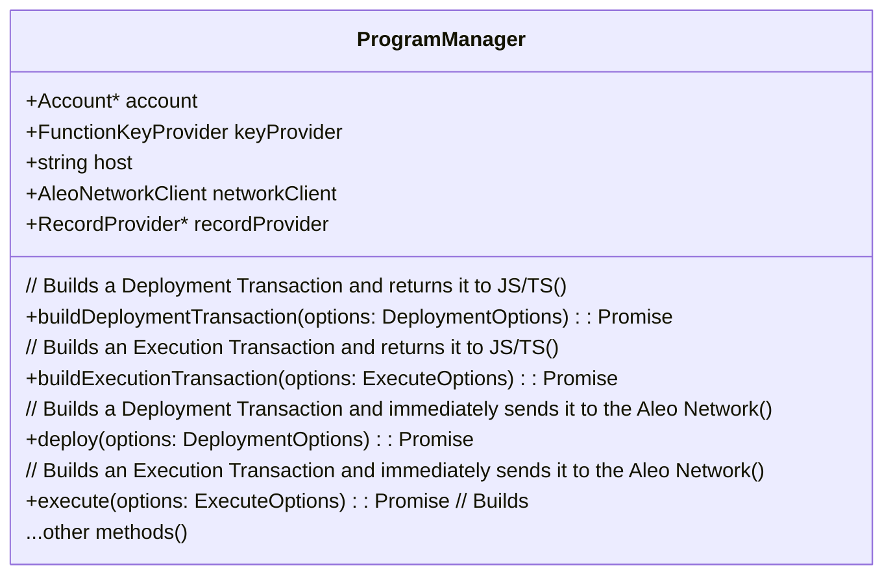

The Provable SDK provides the ability to build `Execution transactions` locally and submit them to the Aleo Network.

The `ProgramManager` class encapsulates the functionality for executing programs and building `Execution Transactions`. 
The ProgramManager calls code from [snarkVM](https://github.com/ProvableHQ/snarkVM) that has been compiled into WebAssembly.
This code runs the execution, creates the resulting transitions and the zk-SNARK proof of the execution within the 
local WebAssembly environment and returns an `Execution Transaction` when it is finished. Once the transaction is built,
it is submitted to the Aleo network using the `NetworkClient` class.

This process is visualized within the following diagram. The necessary steps to perform these actions within JavaScript
or Typescript are explained in this guide.



## 1. WebAssembly Initialization
Before executing a function within the Browser or Node environment. This is done
by calling `initThreadPool` function which initializes `wasm` memory and creates a `wasm` instance which can take 
advantage of multiple available threads on the host machine.

```typescript
import { Account, initThreadPool } from '@provablehq/sdk/mainnet.js';

// Enables multithreading
await initThreadPool();

// Create a new Aleo account
const account = new Account();

// Perform further program logic...
````

This step MUST
1. Be performed before any other operations are executed. 
2. Be performed only once per for the entire application lifecycle. **Do not call `initThreadPool` multiple times.**

## 2. Building an Execution Transaction
The `ProgramManager` class has multiple convenience methods for building `Execution` and `Deployment` transactions. 
Shown below is a partial class diagram of the `ProgramManager` class introducing the methods that are used to build 
general execution and deployment transactions.



There are two main methods for building general execution transactions: `execute` and `buildExecutionTransaction`. 
Calling `execute` will build and submit the transaction to the Aleo network, while `buildExecutionTransaction` will
only build the transaction and return it to the caller within Javascript.

The example below illustrates how to instantiate a `ProgramManager`, build an execution transaction, and submit it to
the Aleo network (note: Ensure that your project supports `top-level await`).

```typescript
import { Account, AleoNetworkClient, initThreadPool, NetworkRecordProvider, ProgramManager, AleoKeyProvider } from '@provablehq/sdk/mainnet.js';

// If the threadpool has not been initialized, do so (this step can be skipped if it's been initialized elsewhere). 
await initThreadPool();

// Create an account from the desired private key.
const account = new Account({ privateKey: 'APrivateKey1...'});

// Create a network client to connect to the Aleo network.
const networkClient = new AleoNetworkClient("https://api.explorer.provable.com/v1");

// Create a key provider that will be used to find public proving & verifying keys for Aleo programs.
const keyProvider = new AleoKeyProvider();
keyProvider.useCache = true;

// Initialize a program manager to talk to the Aleo network with the configured key and record providers.
const programManager = new ProgramManager(networkClient, keyProvider);

// Set the account for the program manager.
programManager.setAccount(account);

try {
    // Provide a key search parameter to find the correct key for the program if they are stored in a memory cache
    const keySearchParams = { cacheKey: "betastaking.aleo:stake_public" };
    console.log("Key search parameters set: ", keySearchParams);

    // Execute the program using the options provided inline and get the transaction.
    const tx = await programManager.buildExecutionTransaction({
        programName: "betastaking.aleo",
        functionName: "stake_public",
        priorityFee: 0.10,
        privateFee: false, // Assuming a value for privateFee
        inputs: ["aleo17x23al8k9scqe0qqdppzcehlu8vm0ap0j5mukskdq56lsa25lv8qz5cz3g", "50000000u64"], // Example inputs matching the function definition
        keySearchParams: keySearchParams,
        privateKey: account.privateKey() // Set the private key
    });
    
    // Submit the program to the network.
    const transaction_id = await programManager.networkClient.submitTransaction(tx);
    console.log("Transaction details: ", transaction);
} catch (error) {
    console.error("Error executing program:", error);
}

// Generally the transaction will need 1-3 blocks (3-9 seconds) to be confirmed on the network. When that time has 
// elapsed the following function can be used to get the transaction details.
const transaction = await programManager.networkClient.getTransaction(tx_id);
```

### Key Provider: Finding Proving and Verifying Keys

A reader of the above example may notice `KeyProvider` class. 

Since each function in a program has a proof associated with it, each function in a program has something called a
`ProvingKey` and `VerifyingKey`. These keys are cryptographic material that uniquely identifies the structure of the
function and are required to build the proof and verify the proof respectively. A unique `ProvingKey` and `VerifyingKey`
is generated for each function in a program.

If an execution in the SDK does not have the keys, it will generate them. However, generating them is a computationally
expensive process, and significantly slows down the execution process if they need. It is wise for developers to store
them for re-use when possible. The SDK provides an interface called the `KeyProvider` to enable developers to define
easy ways to retrieve these keys.

The default implementation of the `KeyProvider` interface is the `AleoKeyProvider`. This `KeyProvider` implementation 
allows users to specify an optional HTTP url where the keys may be found and an in-memory cache for proving and 
verifying keys. However, developers can implement their own `KeyProvider` to store keys in places such as CDNs, 
databases, local file systems, etc.

```typescript
import { AleoKeyProvider, VerifyingKey, ProvingKey } from '@provablehq/sdk/mainnet.js';

// The Aleo key provider is the default implementation of the key provider.
const keyProvider = new AleoKeyProvider();
// This flag enables the cache for the key provider. If the cache is enabled, the key provider will store the keys in 
// memory after being fetched for the first time.
keyProvider.useCache = true;

// The key provider allows specification of HTTP uris where proving keys and verifying keys can be found and a cache 
// key for storing them.
const keySearchParams = { "proverUri":"http://mykeylocation.com/prover", "verifierUri":"http://mykeylocation.com/verifier", "cacheKey": "myProgram:myFunction" };
const [provingKey, verifyingKey] = await keyProvider.functionKeys(keySearchParams);

// If the keys are not located in remote locations (perhaps they are stored locally), the cache key can be used alone
// to store the keys in memory.

// Create a local proving key and verifying key.
const localProvingKey = ProvingKey.fromString("..");
const localVerifyingKey = VerifyingKey.fromString("..");
keyProvider.cacheKeys("myProgram.aleo:myFunction", [localProvingKey, localVerifyingKey]);

// Retrieve the keys from the in-memory cache.
const [storedProvingKey, storedVerifyingKey] = await keyProvider.functionKeys({ "cacheKey": "myProgram:myFunction" });
```

## 3. Local program execution

It is also possible to simply execute a program locally without sending a transaction to the Aleo network. This can be 
useful if a developer wants to use the SDK to use Aleo's zk-SNARKs outside of the Blockchain network or run a test 
execution of a program while developing. For this purpose the `ProgramManager` class has a method called `run` that can 
be used to execute a program locally.

### Development - Running Locally without a Proof
When the developer sees fit to simply see the output of a function without generating a proof, the `run` method of
`ProgramManager` can be used. It simply needs the program, the function name, and the inputs to the function. 

When run in this fashion, the program will execute and return the outputs of the function without generating a proof.
This can be useful for testing a function in development.

```typescript
import { Account, ProgramManager } from '@provablehq/sdk/mainnet.js';

/// Create the source for the "hello world" program
const program = "program helloworld.aleo;\n\nfunction hello:\n    input r0 as u32.public;\n    input r1 as u32.private;\n    add r0 r1 into r2;\n    output r2 as u32.private;\n";
const programManager = new ProgramManager();

/// Create a temporary account for the execution of the program
const account = new Account();
programManager.setAccount(account);

/// Get the response and ensure that the program executed correctly
const executionResponse = await programManager.run(program, "hello", ["5u32", "5u32"]);
const result = executionResponse.getOutputs();
assert.deepStrictEqual(result, ['10u32']);
```

### Offchain Proving - Running Locally WITH a Proof
If the developer wants to generate a proof for a program execution without sending it to the Aleo network, the `run` 
method can be used with the `generateProof` flag set to true. This will generate an `ExecutionResponse` object that
includes the proof of the execution which can be verified offchain by the `verifyFunctionExecution` method by anyone who
has the function's proving and verifying keys.

Note: This approach is **will not work** for any function that has an async future defined within it.

```typescript
import { Account, AleoKeyProvider, ProgramManager, ProvingKey, VerifyingKey } from '@provablehq/sdk/mainnet.js';
import { getBindingIdentifiers } from "@babel/types";
import keys = getBindingIdentifiers.keys;

/// Initialize the key provider and network client.
const networkClient = new AleoNetworkClient("https://api.explorer.provable.com/v1");
const keyProvider = new AleoKeyProvider();
keys.useCache = true;

/// Define the program.
const program = "program helloworld.aleo;\n\nfunction hello:\n    input r0 as u32.public;\n    input r1 as u32.private;\n    add r0 r1 into r2;\n    output r2 as u32.private;\n";

/// Create the proving and verifying keys for the program and store them in the key provider.
const provingKey = ProvingKey.fromString("...");
const verifyingKey = VerifyingKey.fromString("...");
keyProvider.cacheKeys("helloworld.aleo:main", [provingKey, verifyingKey.clone()]);

/// Create a program manager with the key provider.
const programManager = new ProgramManager(networkProvider, KeyProvider);

/// Create a temporary account for the execution of the program
const account = new Account();
programManager.setAccount(account);


/// Get the response and ensure that the program executed correctly
const executionResponse = await programManager.run(program, "hello", ["5u32", "5u32"], true, undefined, {"cacheKey":"helloworld.aleo:main");

/// Verify the proof of the execution
const proofIsValid = await programManager.verifyFunctionExecution(executionResponse.getExecution(), "helloworld.aleo:main", program, "main");
```