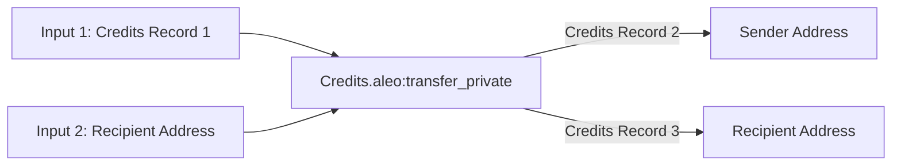
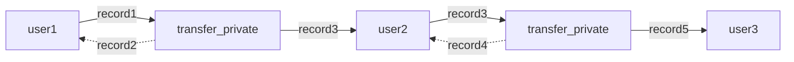

## Records
Records are analogous to the Bitcoin concept of [UTXOs](https://en.wikipedia.org/wiki/Unspent_transaction_output). When a record is
created by a program, it can then be consumed later by the same program as an input to a function. Once a record is used
as an input, it is considered consumed and cannot be used again. In many cases a new record will be created from the output
of the function. Records are private by default and are associated with a single Aleo program and a single private key
representing a user.

### Record usage example: private value transfers

A straightforward example of a usage of records in a program can be demonstrated by explaining the process of private
value transfers of Aleo credits on the Aleo network.

Aleo credits are used for all on-chain execution and deployment fees. Credits can be public or private. Private credits
are represented by the `credits` record in the [credits.aleo](https://explorer.provable.com/program/credits.aleo)
program.

```
record credits:
    owner as address.private;
    microcredits as u64.private;
```

Credits records contain an `owner` field representing the address which owns the record and a `microcredits` field
representing the amount of microcredits in the record. 1 credit is equal to 1,000,000 microcredits.

An example of an Aleo function that both takes a record as input and outputs a record is the `transfer_private` function
of the `credits.aleo` program. This function takes a private `credits` record as input and outputs two new private `credits`
records as output (one that sends the credits to the recipient and one that sends the remaining credits to the sender).

The source code for the `transfer_private` is:
```
function transfer_private:
    input r0 as credits.record;
    input r1 as address.private;
    input r2 as u64.private;
    sub r0.microcredits r2 into r3;
    cast r1 r2 into r4 as credits.record;
    cast r0.owner r3 into r5 as credits.record;
    output r4 as credits.record;
    output r5 as credits.record;
```

The `transfer_private` function can be graphically represented by the graph below. In the graph the first record, Record 1,
is consumed and can never be used again. From the data in Record 1, two more records are created. One containing
the intended amount for the recipient which is now owned by the recipient and another containing the remaining credits
which are sent back to the sender.



This chain of ownership is tracked by the Aleo blockchain by storing the encrypted input and output records within
the ledger. This allows other users who receive records to receive scan the chain for new record outputs from functions.

This allows a chain of private state to be created between users. For private Aleo Credit transfers, a chain of state 
might look like the following:



The above state chain would be executed in the following way using the SDK:
#### Step 1 - User 1 sends a private value transfer to User 2
```typescript
// USER 1
import { Account, ProgramManager, AleoKeyProvider, NetworkRecordProvider, AleoNetworkClient } from '@provablehq/sdk';

// Create a new NetworkClient, KeyProvider, and RecordProvider
const account = Account.from_string({privateKey: "user1PrivateKey"});
const networkClient = new AleoNetworkClient("https://api.provable.com/v2");
const keyProvider = new AleoKeyProvider();
const recordProvider = new NetworkRecordProvider(account, networkClient);

// Initialize a program manager with the key provider to automatically fetch keys for executions
const USER_2_ADDRESS = "user2Address";
const programManager = new ProgramManager("https://api.provable.com/v2", keyProvider, recordProvider);
programManager.setAccount(account);

/// Send private transfer to User 2
const tx_id = await programManager.transfer(1, USER_2_ADDRESS, "transfer_private", 0.2);
```

#### Step 2 - User 2 receives the transaction ID and fetches the credits record they received from User 1 from the network. They then send it to User 3

```typescript
// USER 2
import { Account, ProgramManager, AleoKeyProvider, NetworkRecordProvider, AleoNetworkClient } from '@provablehq/sdk';

// Create a new NetworkClient, KeyProvider, and RecordProvider
const account = Account.from_string({privateKey: "user2PrivateKey"});
const networkClient = new AleoNetworkClient("https://api.provable.com/v2");
const keyProvider = new AleoKeyProvider();
const recordProvider_User2 = new NetworkRecordProvider(account, networkClient);

// Initialize a program manager with the key provider to automatically fetch keys for executions
const programManager = new ProgramManager("https://api.provable.com/v2", keyProvider, recordProvider);
programManager.setAccount(account);

// Fetch the transaction from the network that user 1 sent
const transaction = await programManager.networkClient.getTransaction(tx_id);
const record = <string>transaction.execution.transitions[0].outputs[0].value;

// Decrypt the record with the user's view key
const recordCiphertext = <RecordCiphertext>RecordCiphertext.fromString(record);
const recordPlaintext = <RecordPlaintext>recordCiphertext.decrypt(account.viewKey());

// Send a transfer to user 3 using the record found above
const USER_3_ADDRESS = "user3Address";
const tx_id = await programManager.transfer(1, USER_3_ADDRESS, "transfer_private", 0.2, undefined, recordPlaintext);
```

When an execution such as `transfer_private` consumes or generates a record, the record inputs and outputs are visible
in encrypted form within the transitions of the execution transaction `transfer_private` occured within.

Because the record inputs and ouputs are encrypted, no details are revealed about the sender or receiver of the 
transaction.

<details>
<summary>`transfer_private` Execution Transcript</summary>

```json
  "transactions": [
    {
      "status": "accepted",
      "type": "execute",
      "index": 0,
      "transaction": {
        "type": "execute",
        "id": "at1s7dxunms8xhdzgaxrwf0yvq2dqgxtf4a3j8g878rhfr0zwhap5gqywsw8y",
        "execution": {
          "transitions": [
            {
              "id": "as1thy8fvkz0rkls5wnmfq5udrcvvzurq7mqk8pkhjf63htqjf9mugqp0mfhd",
              "program": "credits.aleo",
              "function": "transfer_private",
              "inputs": [
                {
                  "type": "record",
                  "id": "1406044754369042876058586523429806531093330762697573675195902502647806778955field",
                  "tag": "242626059121157295593694555515381893342956813170338731374395259242800138642field"
                },
                {
                  "type": "private",
                  "id": "1533599744296862879610225011439684001995294756698105572984689232395187168232field",
                  "value": "ciphertext1qgqgpu7m8p0rwjahwffyvm4g4n6903d6ufqty74z4504w4rn356hgp9jvpuvx8suu0pukr3sl7n8x65dz35nu4jdy4lgcguxldygufrfpyqd6xr5"
                },
                {
                  "type": "private",
                  "id": "4081557229261486898857101724786348855190759711760925564309233047223407640812field",
                  "value": "ciphertext1qyqxd9wue0qh8hs6dgevn7zleedfkzf7pft8ecked2xq3pw54pgqzyqr69sgx"
                }
              ],
              "outputs": [
                {
                  "type": "record",
                  "id": "1388064668770056715587596299070268626507043043686185311840561493640415146425field",
                  "checksum": "5376939704883651492329501631722578074516322228314928758786996843926470523116field",
                  "value": "record1qyqsq4r7mcd3ystjvjqda0v2a6dxnyzg9mk2daqjh0wwh359h396k7c9qyxx66trwfhkxun9v35hguerqqpqzqzshsw8dphxlzn5frh8pknsm5zlvhhee79xnhfesu68nkw75dt2qgrye03xqm4zf5xg5n6nscmmzh7ztgptlrzxq95syrzeaqaqu3vpzqf03s6"
                },
                {
                  "type": "record",
                  "id": "4635504195534945632234501197115926012056789160185660629718795843347495373207field",
                  "checksum": "3428805926164481449334365355155755448945974546383155334133384781819684465685field",
                  "value": "record1qyqsp2vsvvfulmk0q0tmxq7p9pffhfhha9h9pxsftujh57kkjuahx9s0qyxx66trwfhkxun9v35hguerqqpqzq8etfmzt2elj37hkf9fen2m2qes8564sr8k970zyud5eqmq7ztzq5r3095mkfdzqzz7yp6qfavqsl3t22t6dvgauqqt2xqk98zwmtusq5ck7fm"
                }
              ],
              "tpk": "5283803395323806407328334221689294196419052177553228331323093330938016699852group",
              "tcm": "4398026033398688325681745841147300822741685834906186660771751747897598751646field"
            }
          ],
```
</details>

## Record Decryption

If a user receives a private record from a program execution, they can use the SDK to decrypt encrypted records with
their view keys and view their contents. Only records that are owned by the user can be decrypted. Decryption of records
that are not owned by the user will fail.

Record decryption and ownership verification can be done in the SDK using the following code:

```typescript
import { Account, RecordCiphertext, RecordPlaintext } from '@provablehq/sdk';

// Create an account from an existing private key
const account = Account.from_string({privateKey: "existingPrivateKey"});

// Record value received as a string from program output or found on the Aleo network
const record = "record1qyqsq4r7mcd3ystjvjqda0v2a6dxnyzg9mk2daqjh0wwh359h396k7c9qyxx66trwfhkxun9v35hguerqqpqzqzshsw8dphxlzn5frh8pknsm5zlvhhee79xnhfesu68nkw75dt2qgrye03xqm4zf5xg5n6nscmmzh7ztgptlrzxq95syrzeaqaqu3vpzqf03s6";

const recordCiphertext = RecordCiphertext.fromString(record);

// Check ownership of the record. If the account is the owner, decrypt the record
if (RecordCiphertext.is_owner(account.viewKey())) {
   // Decrypt the record with the account's view key
   const recordPlaintext = recordCiphertext.decrypt(account.viewKey());

   // View the record data
   console.log(recordPlaintext.toString());
}
```

A record can be decrypted by a non-owner using a record view key for use cases requiring inspection of the data contained within a 
record by a third party.  This approach enables a user to maintain privacy over the rest of their records and ciphertext data, 
ensuring that only the desired record can be decrypted a third party.

```typescript
import {Account, EncryptionToolkit, Field, RecordCiphertext, RecordPlaintext} from '@provablehq/sdk';

// Create an account from an existing private key
const account = Account.from_string({privateKey: "existingPrivateKey"});

// Record value received as a string from program output or found on the Aleo network
const record = "record1qyqsq4r7mcd3ystjvjqda0v2a6dxnyzg9mk2daqjh0wwh359h396k7c9qyxx66trwfhkxun9v35hguerqqpqzqzshsw8dphxlzn5frh8pknsm5zlvhhee79xnhfesu68nkw75dt2qgrye03xqm4zf5xg5n6nscmmzh7ztgptlrzxq95syrzeaqaqu3vpzqf03s6";

const recordCiphertext = RecordCiphertext.fromString(record);

// The owner generates the record view key for a specific record
const recordViewKey = recordCiphertext.recordViewKey(account.viewKey());

// Alternatively, the record view key can be generarted using a method from the EncryptionToolkit object
const recordViewKeyAlt = EncryptionToolkit::gnerateRecordViewKey(accoutn.viewKey(), recordCiphertext);

// A third party can now decrypt the record using the record view key
const recordPlaintext = recordciphertext.decryptWithRecordViewKey(recordViewKey);

// Alternatively, the record can be decrypted using a method from the EncryptionToolkit object
const recordPlaintextAlt = EncryptionToolkit::decryptRecordWithRVk(recordViewKeyAlt, reocrdCiphertext);