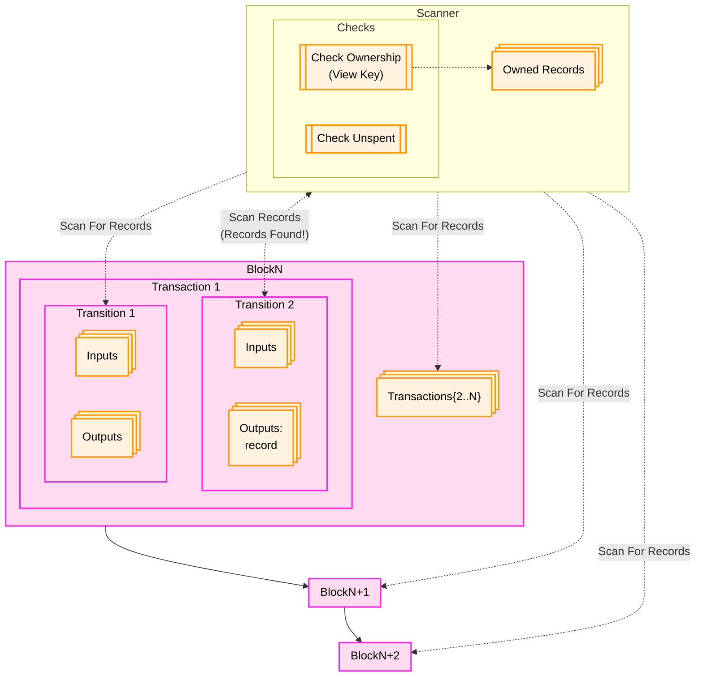

Finding records is similar to finding UTXOs in Bitcoin. Records are stored as outputs of transitions contained within 
execution transactions. To find records, implementors of web apps must:
* Scan the Aleo network for transactions that include transitions that contain records.
* Check any found records to see if the desired user is the owner of the record.
* Check to see if the record is "spent" or "unspent" by checking if the record has appeared in any function inputs.
* Optionally decrypt the record if the data within it is desired.



## Finding Records Using the SDK

Although the process described above seems complicated, much of the complexity is encapsulated within the SDK.

### Finding Records with The `AleoNetworkClient` Convenience Methods
The `AleoNetworkClient` provides the `findRecords` methods fo finding records. This method allows records to be 
searched for between specified block heights. 

It also optionally allows users to specify:
* The option to search exclusively for unspent records.
* One or more programs to find records for.
* A list of nonces (i.e. the unique ID of a record) to exclude from the search. 

If `credits.aleo`records are being searched for, users can also optionally specify:
* A list of amounts to find.
* A maximum cumulative amount to find between all records.

```typescript
import { AleoNetworkClient } from '@provablehq/sdk';

const account = new Account.fromCiphertext(process.env.cipherText, process.env.secret);
const networkClient = new AleoNetworkClient("https://api.provable.com/v2", undefined, account);

// Find all records from an account within a block range.
const allRecords = networkClient.findRecords(
    4370000, // Start block height
    4371000, // End block height
    false, // Find both spent and unspent records.
    ["credits.aleo", "token_registry.aleo"], // Find records for the credits.aleo and token_registry.aleo programs.
);

// Find only unspent records from an account within a block range that can be used as inputs to new functions.
const unspentRrecords = networkClient.findRecords(
    4370000, // Start block height
    4371000, // End block height
    true, // Find both spent and unspent records.
    ["credits.aleo", "token_registry.aleo"], // Find records for the credits.aleo and token_registry.aleo programs.
);
```

This method provides a linear search through the block range specified. It is most useful for finding records
in smaller block ranges where the app invoking the method can expect to find desired records. For larger ranges of 
blocks this method may be infeasible to use.

### Implementing the `RecordProvider` interface.
In order to conveniently find records during execution, the implementations of `RecordProvider` can be used. This 
interface allows developers to implement an efficient search strategy for finding new records. A default implementation
of the `RecordProvider` interface is provided by the `NetworkRecordProvider` class, but developers can use the 
`RecordProvider` interface to implement their own search strategies.

When a `RecordProvider` is provided within the constructor of a `ProgramManager` object and `RecordSearchParameters` are
provided to a function that executes a function, and a private fee is specified, the `ProgramManager` will automatically 
search for an appropriate record to pay the fee.

A usage example of the `RecordProvider` is shown below using the `NetworkRecordProvider` implementation of the
`RecordProvider` interface.
```typescript
import { AleoNetworkClient, AleoKeyProvider, NetworkRecordProvider, ProgramManager } from '@provablehq/sdk';

// Create a new NetworkClient, KeyProvider, and RecordProvider using official Aleo record, key, and network providers
const networkClient = new AleoNetworkClient("https://api.provable.com/v2");
const keyProvider = new AleoKeyProvider();
keyProvider.useCache(true);
const recordProvider = new NetworkRecordProvider(account, networkClient);

// Initialize a program manager with the key provider to automatically fetch keys for executions
const programManager = new ProgramManager("https://api.provable.com/v2", keyProvider, recordProvider);

// Find a record to pay the fee for the transaction
let inputRecordSearchParameters = {
    programs: ["credits.aleo"], // Find records for the credits.aleo program.
    amounts: [10_000_000], // Find the amount desired to be transferred.
    startHeight: 4370000, // Specify the start of a block range where unspent records are likely to be found.
    endHeight: 4371000, // Specify the end of a block height range where unspent records are likely to be found.
}
const record = await programManager.recordProvider.findRecords(
        true, // Find only unspent records.
        undefined, // No nonces need to be excluded because only one record is being searched for.
        inputRecordSearchParameters,
);

// Record the nonce of the found record so it's not selected again.
const nonce = record.nonce();
const feeRecordSearchParameters = {
    programs: ["credits.aleo"], // Find records for the credits.aleo program.
    amounts: [40_000], // Find the amount desired to be transferred.
    startHeight: 4370000, // Specify the start height.
    endHeight: 4371000, // Specify the end height.
    nonces: [nonce], // Exclude the nonce of the record found for the transfer.
}

const transaction = await programManager.buildExecutionTransaction({
  programName: "credits.aleo",
  functionName: "transfer_private",
  fee: 0.040,
  privateFee: true,
  inputs: ["aleoAddress1..", "10000000u64"],
  recordSearchParams: feeRecordSearchParameters, // Specify the record search parameters for the fee record.
});

const result = await programManager.networkClient.submitTransaction(transaction);
```

## Optimizing web search
Using naive approaches such as scanning the entire Blockchain history can be a time-consuming process and degrade the
experience of a web app. Fortunately, strategies can be used to optimize the process.

#### Searching for Records After the User Account Creation
If the user a web app has created an Aleo account after a known block, the search can be optimized to search for records
by only scanning the records from the block height after which the account was created. 

#### Searching for A Specific Program's Records
If the records you are searching for are from a specific program, you can optimize the search by only scanning the 
records for a specific program.

#### Storing Records Created by Your Web App
If your web app has created a transaction, you have access to the records produced by that transaction and can store
them in a database for easy retrieval later.