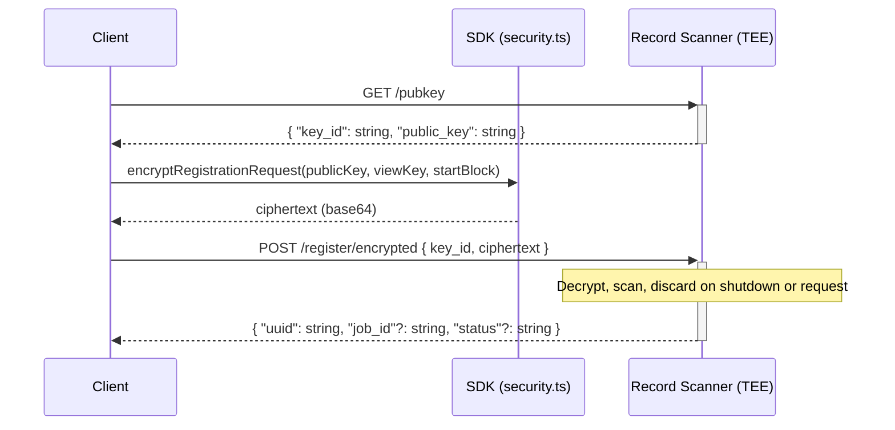
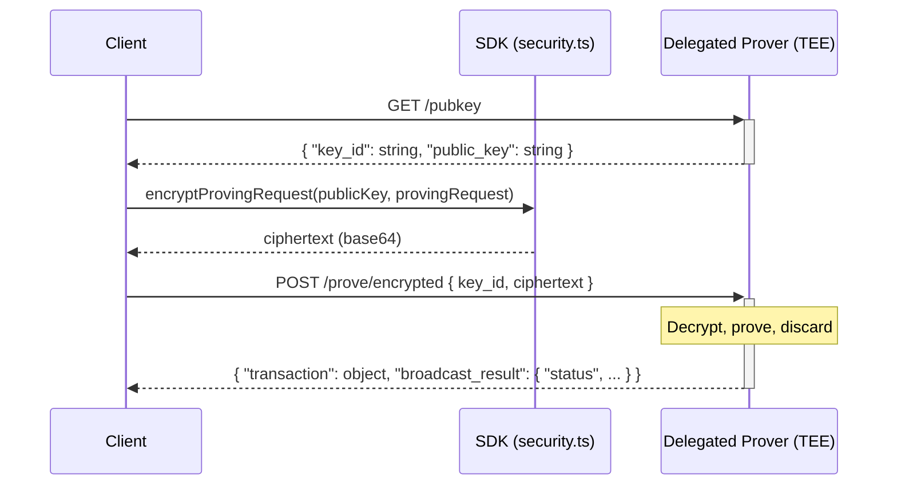

# Delegated Proving and Record Scanning

This guide explains the usage of the **Delegated Proving** (DPS) and **Record Scanning** (RSS) services. 

# Contents

- [Overview](#overview)
- [Credentials and authentication](#credentials-and-authentication)
- [Record Scanning Service (RSS)](#record-scanning-service-rss)
- [Delegated Proving Service (DPS)](#delegated-proving-service-dps)
- [Quick reference](#quick-reference)
- [Best practices](#best-practices)

---

# Overview

## Delegated Proving Service (DPS)

The Aleo blockchain allows users to execute programs on-chain while preserving the privacy of the inputs and outputs to 
those functions. This enables applications like private value transfers, private identity verification, private swaps 
and more.

Building these proofs in a completely privately is traditionally done on a local device, however this proess often takes
a significant amount of time.

Delegated proving allows users to delegate generation of proofs to an external service which can produce proofs quickly
and privately within a Trusted Execution Environment that ensures no one but the caller knows the content of the proof.

Generally this works in the following way:
1. **Build** a *proving request* (program, function, inputs, fee settings, broadcast flag).
2. **Submit** it to the delegated prover in **encrypted** form, which only decrypted within a TEE.
3. The proving service submits the **transaction** to the blockchain.

This guide helps users instrument delegated Proving and Record Scanning to power their privacy preserving applications.

## Record Scanning Service (RSS)

The Aleo network uses UTXO style struct data structures called `Records` to share encrypted information between parties.
Records can represent abritrary information (depending on the context of the program its defined in) such as transfers 
of encrypted funds from one user to another or encrypted identity verification. 

As an example. Aleo uses the `credits`record in the credits.aleo program to represent private transfers of value between
on use and another.

```
record credits:
   owner as address.private;
   microcredits as u64.private;
```

When a record is generated by a function, it appears on the Aleo blockchain in encrypted form and is only decryptable by
the owner of the record. Further, like UTXOS, a record can only be used once as in an input and thereafter it is 
considered used/spent by the Aleo chain. Any inputs also appear on-chain as encrypted data.

Because all records are encrypted, a user must find their records by scanning the inputs and outputs on the entire chain
attempting to decrypt these inputs/outputs with their private ViewKey. 

The record scanner provides a service indexes that Aleo ledger and indexes records which belong to specific Aleo accounts.
Users provided their ViewKey in encrypted form to a record scanner within an enclave and that key is used to find all
records for a user. Neither the scanner service nor any other outside party except for the ViewKey holder is able 
perceive the ViewKey due to the trusted execution environment.

Upon registration of an Aleo account, the record scanner identifies all records associated with that account and 
provides the owner of that account with all records they currently own allowing them to keep track of things like
private balances.

---
# Usage Guide

This guide shows how to access the record scanning and delegated proving with JS/TS either using the Provable SDK or
custom TS/JS code.

## Credentials and authentication
The Delegated Proving Service (DPS) and the record scanning service (RSS) are both hosted behind the provable API at 
https://api.provable.com/v2.

To authenticate to these service you need.

- **API key** and **consumer ID** — Obtain these by registering a consumer (e.g. `POST {baseUrl}/consumers`). See [Provable API documentation](https://docs.provable.com/docs/api/services/get-auth-register) for details.
- **JWT** — Used for authenticated endpoints (e.g. DPS). The SDK refreshes the JWT by calling `POST https://api.provable.com/jwts/{consumerId}` with header `X-Provable-API-Key: <apiKey>`. You can also obtain and cache the JWT yourself and pass it in when using the SDK or your own client.

The **Record scanner** endpoints may accept the API key in a header (e.g. `X-Provable-API-Key`) or an issued JWT.

The **Delegated prover** endpoints typically require a JWT in the `Authorization` header; the SDK handles JWT refresh 
when both `apiKey` and `consumerId` are configured.

### Base URLs

The SDK appends the network (`mainnet` or `testnet`) to the host you provide. For example, if the host is 
`https://api.provable.com/v2`, the effective base url  is:
* Prover: 
  * Mainnet: `https://api.provable.com/v2/prove/mainnet`
  * Testnet: `https://api.provable.com/v2/prove/tesnet`
* Scanner:
  * Mainnet: `https://api.provable.com/v2/scanner/mainnet`
  * Testnet: `https://api.provable.com/v2/scanner/testnet`

## Record Scanning Service (RSS)

When using the record scanning service, users must first register their encrypted view key to the record scanner TEE via
the following flow.

### Flow (encrypted registration)
0. Client must obtain an API key or JWT from the provable API.
1. Client requests an ephemeral X25519 public key from the scanner: `GET {scannerBase}/pubkey`.
2. Client encrypts the view key and start block (e.g. with [encryptRegistrationRequest](https://github.com/ProvableHQ/sdk/blob/mainnet/sdk/src/security.ts#L51)) and sends: `POST {scannerBase}/register/encrypted` with `{ key_id, ciphertext }`.
3. Scanner decrypts in a secure environment, indexes records for that view key, and returns a `uuid` (and optional `job_id`, `status`). The client uses `uuid` for subsequent queries (e.g. owned records).



### Key Routes (record scanner)

All paths are relative to the scanner base URL (e.g. `https://api.provable.com/v2/mainnet` or your scanner host + network).

The following key routes are available on the record scanner.

| Path | Method | Purpose                                                                     | Request body                                   | Response |
|------|--------|-----------------------------------------------------------------------------|------------------------------------------------|----------|
| `/pubkey` | GET | Ephemeral public key to encrypt the ViewKey prior to encrypted registration | —                                              | `{ "key_id": string, "public_key": string }` |
| `/register/encrypted` | POST | Register view key (encrypted)                                               | `{ "key_id": string, "ciphertext": string }`   | `{ "uuid": string, "job_id"?: string, "status"?: string }` |
| `/records/owned` | POST | Get owned records for a UUID                                                | `{ "uuid": string, "unspent"?: boolean, ... }` | Array of owned records (see SDK `OwnedRecord`) |

If the scanner returns **422** on `/records/owned`, the UUID may no longer be valid; re-register (e.g. via `/register/encrypted`) and retry.

---

### Using the Record Scanner via the Provable SDK

1. Create a `RecordScanner` with the service URL. The SDK appends the network (e.g. `/mainnet`).
2. Optionally set an API key: `recordScanner.setApiKey("your-api-key")` or a JWT `recordScanner.setJwtData({jwt: "jwt", expiration: 1810941101})`
3. Register with the **encrypted** flow: `registerEncrypted(viewKey, startBlock)`. The result contains `uuid`; the scanner stores it for later calls.
4. Query owned records with `findRecords(filter)` or `owned(filter)`, where `filter` includes `uuid` (and e.g. `unspent: true`, `filter: { program, record }`).

**Example: register and find records with the SDK**

```ts
import { Account, RecordScanner } from "@provablehq/sdk/mainnet.js";

const account = new Account({ privateKey: "APrivateKey1zkp..." });
const recordScanner = new RecordScanner({
  url: "https://api.provable.com/v2",
});
await recordScanner.setApiKey(process.env.RECORD_SCANNER_API_KEY);

// Encrypted registration (recommended)
const regResult = await recordScanner.registerEncrypted(account.viewKey(), 0);
if (!regResult.ok) {
  throw new Error(regResult.error?.message ?? `Registration failed: ${regResult.status}`);
}
const uuid = regResult.data.uuid;

// Find unspent credits records
const records = await recordScanner.findRecords({
  uuid,
  unspent: true,
  filter: { program: "credits.aleo", record: "credits" },
});
```

---

### Using custom JavaScript (record scanner)

If you prefer not to use the SDK for HTTP, you can call the same endpoints with `fetch` and use the SDK only for encryption.

**Step 1: Get ephemeral public key**

```ts
const scannerBase = "https://api.provable.com/v2/mainnet"; // or your scanner URL + network
const headers: Record<string, string> = { "Content-Type": "application/json" };
if (apiKey) headers["X-Provable-API-Key"] = apiKey;

const pubkeyRes = await fetch(`${scannerBase}/pubkey`, { method: "GET", headers });
if (!pubkeyRes.ok) throw new Error(`Pubkey failed: ${await pubkeyRes.text()}`);
const pubkey = await pubkeyRes.json(); // { key_id, public_key }
```

**Step 2: Encrypt registration and POST**

```ts
import { encryptRegistrationRequest } from "@provablehq/sdk/mainnet.js";
import { Account } from "@provablehq/sdk/mainnet.js";

const account = new Account({ privateKey: "APrivateKey1zkp..." });
const viewKey = account.viewKey();
const startBlock = 0;

const ciphertext = encryptRegistrationRequest(pubkey.public_key, viewKey, startBlock);

const registerRes = await fetch(`${scannerBase}/register/encrypted`, {
  method: "POST",
  headers,
  body: JSON.stringify({ key_id: pubkey.key_id, ciphertext }),
});
if (!registerRes.ok) throw new Error(`Register failed: ${await registerRes.text()}`);

const data = await registerRes.json();
const uuid = data.uuid; // Use this for /records/owned
```

**Step 3: Get owned records**

```ts
const ownedRes = await fetch(`${scannerBase}/records/owned`, {
  method: "POST",
  headers,
  body: JSON.stringify({ uuid, unspent: true }),
});
if (!ownedRes.ok) {
  if (ownedRes.status === 422) {
    // Re-register and retry once
  }
  throw new Error(`Owned records failed: ${await ownedRes.text()}`);
}
const ownedRecords = await ownedRes.json();
```

**Full custom example: encrypted registration and owned records**

```ts
import { encryptRegistrationRequest } from "@provablehq/sdk/mainnet.js";
import { ViewKey } from "@provablehq/sdk/mainnet.js";

async function registerViewKeyEncrypted(
  scannerBase: string,
  viewKey: ViewKey,
  startBlock: number,
  apiKey?: string
): Promise<{ uuid: string; job_id?: string; status?: string }> {
  const headers: Record<string, string> = { "Content-Type": "application/json" };
  if (apiKey) headers["X-Provable-API-Key"] = apiKey;

  const pubkeyRes = await fetch(`${scannerBase}/pubkey`, { method: "GET", headers });
  if (!pubkeyRes.ok) throw new Error(`Pubkey failed: ${await pubkeyRes.text()}`);
  const pubkey = await pubkeyRes.json();

  const ciphertext = encryptRegistrationRequest(pubkey.public_key, viewKey, startBlock);

  const registerRes = await fetch(`${scannerBase}/register/encrypted`, {
    method: "POST",
    headers,
    body: JSON.stringify({ key_id: pubkey.key_id, ciphertext }),
  });
  if (!registerRes.ok) throw new Error(`Register failed: ${await registerRes.text()}`);

  return registerRes.json();
}

async function getOwnedRecords(
  scannerBase: string,
  uuid: string,
  apiKey?: string
): Promise<OwnedRecord[]> {
  const headers: Record<string, string> = { "Content-Type": "application/json" };
  if (apiKey) headers["X-Provable-API-Key"] = apiKey;

  const res = await fetch(`${scannerBase}/records/owned`, {
    method: "POST",
    headers,
    body: JSON.stringify({ uuid, unspent: true }),
  });

  if (res.status === 422) {
    throw new Error("UUID not valid; re-register with registerViewKeyEncrypted and retry.");
  }
  if (!res.ok) throw new Error(`Owned records failed: ${await res.text()}`);

  const data = await res.json();
  return Array.isArray(data) ? data : data?.data ?? [];
}

// Usage
const account = new Account({ privateKey: "APrivateKey1zkp..." });
const result = await registerViewKeyEncrypted(
  "https://api.provable.com/v2/mainnet",
  account.viewKey(),
  0,
  process.env.RECORD_SCANNER_API_KEY
);
const records = await getOwnedRecords(
  "https://api.provable.com/v2/mainnet",
  result.uuid,
  process.env.RECORD_SCANNER_API_KEY
);
```

You can define `OwnedRecord` to match the scanner response shape, or import it from the SDK if available.

### Reference Implementation

[A full implementation of the Record Scanner can be viewed here](https://github.com/ProvableHQ/sdk/blob/mainnet/sdk/src/record-scanner.ts) for usage in one's own SDK.


---

## Delegated Proving Service (DPS)

When using the delegated proving service, users must obtain a Provable API key. They are then able to submit Proving
requests in encrypted form to the delegated proving service.

### Flow (encrypted proving)

0. Client must obtain an API key or JWT from the provable API.
1. Client requests an ephemeral X25519 public key from the prover: `GET {proverBase}/pubkey`.
2. Client builds a *proving request* (authorization, optional fee authorization, broadcast flag), encrypts it via a libsodium cryptobox (e.g. with [encryptProvingRequest](https://github.com/ProvableHQ/sdk/blob/mainnet/sdk/src/security.ts#L26)), and sends it to: `POST {proverBase}/prove/encrypted` with `{ "key_id": string, "ciphertext": string }`.
3. Prover decrypts in a secure environment, runs the proof, and returns a **transaction** and **broadcast_result** (if the request asked for broadcast). The client may submit the transaction themselves or use the broadcast result.



### Routes (delegated prover)

All paths are relative to the prover base URL (e.g. `https://api.provable.com/v2/mainnet` when using the same host as the SDK).

| Path | Method | Purpose | Request body | Response |
|------|--------|----------|--------------|----------|
| `/pubkey` | GET | Ephemeral public key for encrypted proving | — | `{ "key_id": string, "public_key": string }` |
| `/prove/encrypted` | POST | Submit proving request (encrypted) | `{ "key_id": string, "ciphertext": string }` | Same as `/prove` on success |

Authentication (e.g. JWT in `Authorization`, cookies for session) is required for Provable’s API. In Node, you may need 
to forward the `set-cookie` header from the `/pubkey` response to the `/prove/encrypted` request so the prover can 
associate the two calls.

---

### Building a proving request

A **proving request** consists of:

- An **authorization** for the program function (and inputs) the user wants to run.
- An optional **fee authorization** (e.g. `credits.aleo` fee_public / fee_private) to pay for the execution—or **none** 
- when using a fee master (`useFeeMaster: true`).
- A **broadcast** flag indicating whether the prover should submit the resulting transaction to the network.

The SDK builds this in two stages:

1. **Authorize** the main function (program, function name, inputs, private key, optional edition). The base fee is estimated from this authorization.
2. **Optionally authorize the fee** (execution ID, base fee, priority fee, fee record)—unless the program is a fee-related `credits.aleo` function or `useFeeMaster` is true, in which case no fee authorization is attached.

So when you call `programManager.provingRequest(options)`, the SDK resolves the program (and imports, edition) if needed, 
resolves the fee record when not using the fee master, then calls the WASM layer to build the authorization and optional 
fee authorization and wraps them in a `ProvingRequest`. You can then submit that object (or its string form) to the prover.

---

### Using the SDK (delegated proving)

1. Build a proving request with `ProgramManager.provingRequest(options)`. Options include `programName`, `functionName`, `inputs`, `privateFee`, `priorityFee`, `broadcast`, `useFeeMaster`, `privateKey`, `programSource`, `programImports`, `edition`, etc. The SDK fetches the program and edition from the network if not provided.
2. Submit with the **network client**:
   - **`submitProvingRequest(options)`** — Resolves with the proving response on success; **throws** on HTTP 400, 500, 503 (and retries on 500/503).
   - **`submitProvingRequestSafe(options)`** — Returns a result object `{ ok, data }` or `{ ok: false, status, error }` so you can handle errors without try/catch.

Options for submit include `provingRequest` (the built request or its string), `url` (prover URL), `apiKey`, `consumerId`, `jwtData`, and **`dpsPrivacy: true`** to use the encrypted flow (GET `/pubkey`, encrypt, POST `/prove/encrypted`). When using the Provable API, set `apiKey` and `consumerId` (or pass `jwtData`) so the SDK can refresh the JWT.

**Example: build and submit with the SDK (encrypted)**

```ts
import {
  Account,
  AleoKeyProvider,
  ProgramManager,
  NetworkRecordProvider,
  AleoNetworkClient,
} from "@provablehq/sdk/mainnet.js";

const host = "https://api.provable.com/v2";
const account = new Account({ privateKey: process.env.PRIVATE_KEY });
const networkClient = new AleoNetworkClient(host);
const keyProvider = new AleoKeyProvider();
const recordProvider = new NetworkRecordProvider(account, networkClient);
keyProvider.useCache(true);

const programManager = new ProgramManager(host, keyProvider, recordProvider);
programManager.setAccount(account);

// Build the proving request (fee is estimated; optional useFeeMaster)
const provingRequest = await programManager.provingRequest({
  programName: "credits.aleo",
  functionName: "transfer_public",
  priorityFee: 0,
  privateFee: false,
  inputs: [
    "aleo1vwls2ete8dk8uu2kmkmzumd7q38fvshrht8hlc0a5362uq8ftgyqnm3w08",
    "10000000u64",
  ],
  broadcast: false,
});

// Submit with encryption (DPS privacy)
const networkClient = programManager.networkClient;
networkClient.setApiKey(process.env.PROVABLE_API_KEY);
networkClient.setConsumerId(process.env.PROVABLE_CONSUMER_ID);

const response = await networkClient.submitProvingRequest({
  provingRequest,
  dpsPrivacy: true,
});

console.log("Transaction ID:", response.transaction?.id);
console.log("Broadcast status:", response.broadcast_result?.status);
```

**Example: handle errors without throwing**

```ts
const result = await networkClient.submitProvingRequestSafe({
  provingRequest,
  dpsPrivacy: true,
});

if (result.ok) {
  const { transaction, broadcast_result } = result.data;
  // use transaction, broadcast_result
} else {
  console.error(result.status, result.error.message);
}
```

---

### Using custom JavaScript (delegated proving)

You can build the proving request with the SDK (or another tool) and then submit it with your own HTTP client, using the SDK only for encryption.

**Step 1: Get ephemeral public key**

Use the same credentials you will use for the proving POST (e.g. JWT). In Node, capture the `set-cookie` header from the response so you can send it with the next request if the prover uses session cookies.

```ts
const proverBase = "https://api.provable.com/v2/mainnet";
const headers: Record<string, string> = {
  "Content-Type": "application/json",
  "Authorization": jwt,
};

const pubkeyRes = await fetch(`${proverBase}/pubkey`, {
  method: "GET",
  headers,
  credentials: "include",
});
if (!pubkeyRes.ok) throw new Error(`Pubkey failed: ${await pubkeyRes.text()}`);

const pubkey = await pubkeyRes.json();
const cookie = typeof process !== "undefined" && process.versions?.node
  ? pubkeyRes.headers.get("set-cookie")
  : undefined;
```

**Step 2: Build and encrypt the proving request**

Build the request with the SDK (e.g. `programManager.provingRequest(...)`) or from a serialized string. Then encrypt it.

```ts
import { encryptProvingRequest } from "@provablehq/sdk/mainnet.js";
import { ProvingRequest } from "@provablehq/sdk/mainnet.js";

const provingRequest = await programManager.provingRequest({ ... });
const ciphertext = encryptProvingRequest(pubkey.public_key, provingRequest);
```

If you already have the request as a string: `ProvingRequest.fromString(provingRequestString)` before encrypting.

**Step 3: POST encrypted proving request**

```ts
const res = await fetch(`${proverBase}/prove/encrypted`, {
  method: "POST",
  headers: {
    "Content-Type": "application/json",
    "Authorization": jwt,
    ...(cookie ? { Cookie: cookie } : {}),
  },
  credentials: "include",
  body: JSON.stringify({ key_id: pubkey.key_id, ciphertext }),
});

const text = await res.text();
let body: unknown;
try {
  body = JSON.parse(text);
} catch {
  body = { message: text || `${res.status} error` };
}

if (res.ok) {
  const { transaction, broadcast_result } = body as { transaction: any; broadcast_result: any };
  return { ok: true, data: body };
}
const message = typeof (body as any)?.message === "string" ? (body as any).message : text;
return { ok: false, status: res.status, error: { message } };
```

**Full custom example: encrypted delegated proving**

```ts
import { encryptProvingRequest } from "@provablehq/sdk/mainnet.js";
import { ProvingRequest } from "@provablehq/sdk/mainnet.js";

const isNode =
  typeof process !== "undefined" && process.versions != null && process.versions.node != null;

async function submitProvingRequestEncrypted(
  proverBase: string,
  provingRequest: ProvingRequest,
  jwt: string
): Promise<
  | { ok: true; data: { transaction: any; broadcast_result: any } }
  | { ok: false; status: number; error: { message: string } }
> {
  const headers: Record<string, string> = {
    "Content-Type": "application/json",
    "Authorization": jwt,
  };

  const pubkeyRes = await fetch(`${proverBase}/pubkey`, {
    method: "GET",
    headers,
    credentials: "include",
  });
  if (!pubkeyRes.ok) {
    return {
      ok: false,
      status: pubkeyRes.status,
      error: { message: await pubkeyRes.text() },
    };
  }
  const pubkey = await pubkeyRes.json();
  const cookie = isNode ? pubkeyRes.headers.get("set-cookie") : undefined;

  const ciphertext = encryptProvingRequest(pubkey.public_key, provingRequest);

  const res = await fetch(`${proverBase}/prove/encrypted`, {
    method: "POST",
    headers: {
      ...headers,
      ...(cookie ? { Cookie: cookie } : {}),
    },
    body: JSON.stringify({ key_id: pubkey.key_id, ciphertext }),
    credentials: "include",
  });

  const text = await res.text();
  let body: any;
  try {
    body = JSON.parse(text);
  } catch {
    body = { message: text || `${res.status} error` };
  }

  if (res.ok) return { ok: true, data: body };
  return {
    ok: false,
    status: res.status,
    error: { message: body?.message ?? text },
  };
}
```

You can add retries for 500/503 and JWT refresh when the token is expired.

---

## Quick reference

| Service | Step | GET | POST | Encrypt (SDK) |
|---------|------|-----|------|----------------|
| **RSS** | Register (encrypted) | `/pubkey` | `/register/encrypted` with `{ key_id, ciphertext }` | `encryptRegistrationRequest(publicKey, viewKey, startBlock)` |
| **RSS** | Query records | — | `/records/owned` with `{ uuid, unspent?, ... }` | — |
| **DPS** | Prove (encrypted) | `/pubkey` | `/prove/encrypted` with `{ key_id, ciphertext }` | `encryptProvingRequest(publicKey, provingRequest)` |
| **DPS** | Prove (unencrypted) | — | `/prove` with ProvingRequest string | — |

- **One key per request:** Use the `key_id` from the same GET response in the corresponding POST. For retries, fetch a new key from `/pubkey`.
- **Encryption:** Use the SDK’s `encryptRegistrationRequest` and `encryptProvingRequest` (from `@provablehq/sdk`); ciphertext is base64. The same wire format can be implemented with libsodium if you do not use the SDK.

---

## Best practices

1. **Prefer encrypted flows** for production so proving requests and view keys are only decrypted inside the service’s secure environment.
2. **Register before querying:** For RSS, complete registration (encrypted or not) and store the returned `uuid` before calling `/records/owned`. On 422 from `/records/owned`, re-register and retry once.
3. **Handle prover errors explicitly:** Use `submitProvingRequestSafe` when you want to branch on status (400 vs 500/503) without try/catch; use `submitProvingRequest` when you want the SDK to throw after retries.
4. **JWT and cookies:** For DPS with the Provable API, supply `apiKey` and `consumerId` (or a valid `jwtData`) so the SDK can refresh the JWT. In Node, forward the `/pubkey` response cookie to `/prove/encrypted` when the prover uses session cookies.
5. **Fee master:** When the prover or your deployment supports a fee master, set `useFeeMaster: true` in proving request options so no fee authorization is built; the prover pays the fee on your behalf.
6. **Record scanner with ProgramManager:** You can pass a `RecordScanner` (or any `RecordProvider`) into `ProgramManager`. The manager will then use it to resolve fee records (and inputs) when building executions or proving requests, so you do not have to fetch fee records manually.

