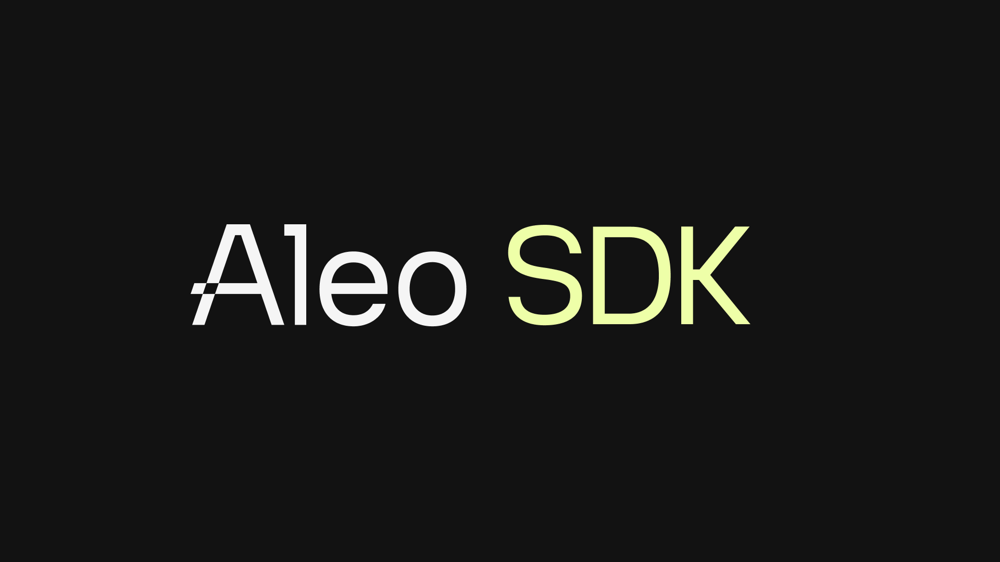
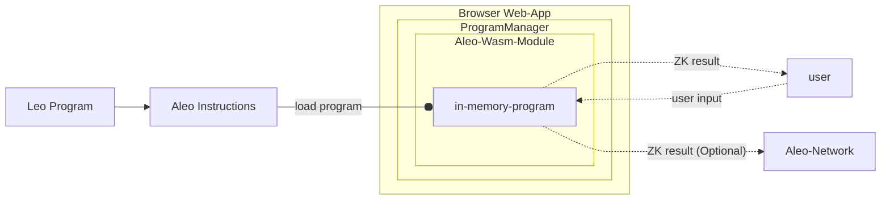
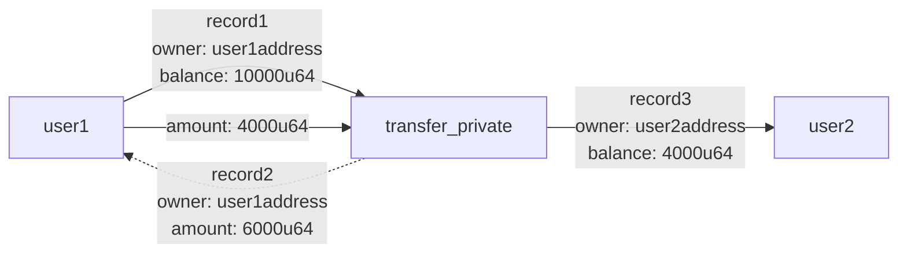
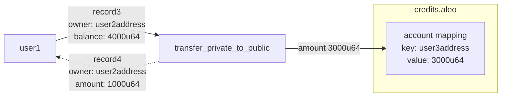
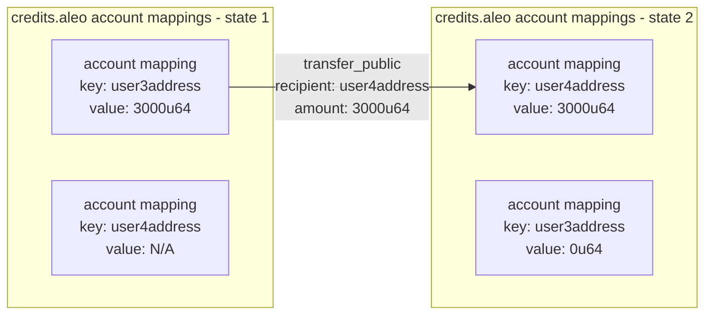
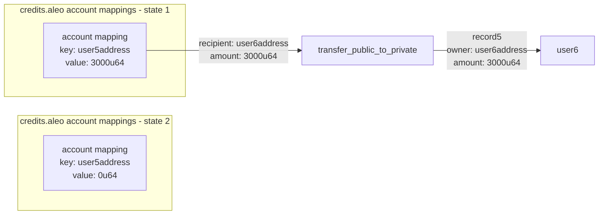
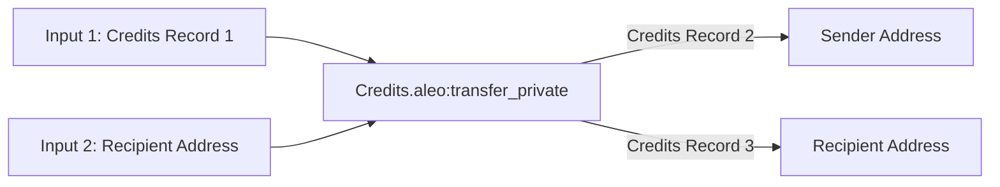
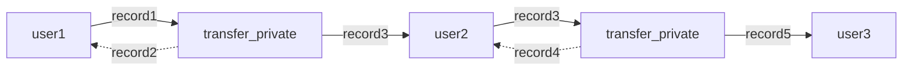

# Aleo SDK
<p align="center">
    
</p>

<p align="center">
    <a href="https://developer.aleo.org"> </a>
    <a href="https://circleci.com/gh/AleoHQ/aleo"></a>
    <a href="https://discord.com/invite/aleo"></a>
    <a href="https://github.com/AleoHQ/sdk#%EF%B8%8F-contributors"></a>
</p>

## Tools for Building Zero Knowledge Web Apps

The Aleo SDK is a collection of JavaScript libraries for building zero knowledge web applications in both the browser
and node.js.

## Overview

Aleo provides the ability to run programs in zero knowledge. The Aleo SDK provides the tools to use these programs
within the browser and all other levels of the web stack to build privacy preserving applications.

The Aleo SDK provides the following functionality (Click to see examples):
1. [Aleo account  management](https://aleo.tools/account)
2. [Web-based program execution and deployment](https://aleo.tools/develop)
3. [Aleo credit transfers](https://aleo.tools/transfer)
4. [Management of program state and data](https://aleo.tools/record)
5. [Communication with the Aleo network](https://aleo.tools/rest)

## Table of Contents

* [Installation](#Installation)
* [Usage](#Usage)
  * [Zero Knowledge Web App Examples](#Zero-Knowledge-Web-App-Examples)
    * [Create Aleo App](#create-aleo-app)
    * [Aleo.tools](#aleotools)
  * [Create An Aleo Account](#1-create-an-aleo-account)
  * [Execute Aleo Programs](#2-execute-aleo-programs)
    * [Aleo Programs](#21-aleo-programs)
    * [Program Execution Model](#22-program-execution-model)
    * [WebAssembly Initialization](#23-wasm-initialization)
    * [Local Program Execution](#24-local-program-execution)
    * [Online Program Execution](#25-program-execution-on-the-aleo-network)
    * [Program Proving Keys and Records](#26-program-proving-keys--program-records)
    * [Deploy Programs](#27-deploy-a-new-program-to-the-aleo-network)
    * [React Example](#28-react-example)
  * [Aleo Credit Transfers](#3-value-transfers)
    * [Aleo Credits](#31-aleo-credits)
    * [Transfer Aleo Credits](#32-transfer-aleo-credits)
    * [Check Public Balances](#32-checking-public-balances)
  * [Program Data and Private State](#4-managing-program-data-and-private-state)
    * [Private State Data: Records](#41-private-state-data--records)
    * [Record Usage Example](#42-record-usage-example--private-value-transfers)
    * [Public State Data: Mappings](#43-public-state-data--mappings)
    * [Reading Mappings](#44-reading-mappings)
    * [Initializing and Updating Mappings](#45-initializing--updating-mappings)
  * [Communicating with the Aleo Network](#5-communicating-with-the-aleo-network)
* [Further Documentation](#further-documentation)
## Installation

### NPM

To install the Aleo SDK from NPM run:

`npm install @aleohq/sdk` or `yarn add @aleohq/sdk`.

### Build from source

To build the project from source, go to this project's root and execute:

`npm install && npm run build`

## Getting Started: Zero Knowledge Web App Examples

### Create Aleo App
A set of fully functional examples of zero knowledge web apps can be found in
[create-aleo-app](https://github.com/AleoHQ/sdk/tree/testnet3/create-aleo-app). Create-aleo-app provides several web-app
templates in common web frameworks such as React that can be used as a starting point for building zero knowledge web apps.

Developers can get started immediately with create-react-app by running:
`npm create aleo-app@latest`

### Aleo.tools

Additionally, the SDK powers [aleo.tools](https://aleo.tools) - a React app that provides a graphical interface for most
of the functionality provided by the SDK and can be used as a reference for usage of the SDK. Source code for aleo.tools
can be found [in the SDK repo here](https://github.com/AleoHQ/sdk/tree/testnet3/website)

## Usage

## 1. Create an Aleo Account

The first step in operating a zero knowledge web application is creating a private key which serves as a cryptographic
identity for a user. After a private key is generated, several keys that enable specialized methods of interacting with
Aleo programs can be derived.

These keys include:
#### Private Key
The `Private Key` can be treated as the identity of a user. It is used for critical functions like authorizing zero knowledge
program execution, decrypting private data, and proving ownership of data.
ownership over user data
#### View Key
The `View Key` is derived from the private key and can be used to both decrypt encrypted data owned by a user and prove
ownership of that data.
#### Compute Key
The `Compute Key` can be used to trustlessly run applications and generate transactions on a user's behalf.
#### Address
The `Address` is a user's unique public identifier. It serves as an address for a user to receive both official Aleo
credits and data from other zero-knowledge Aleo programs.

All of these keys can be created using the account object:
```typescript
import { Account } from '@aleohq/sdk';

const account = new Account();

// Individual keys can be then be accessed through the following methods
const privateKey = account.privateKey();
const viewKey = account.viewKey();
const address = account.address();
```

Please note that all keys are considered sensitive information and should be stored securely.

## 2. Execute Aleo Programs

### 2.1 Aleo Programs

Aleo programs provide the ability for users to make any input or output of a program private and prove that the program
was run correctly. Keeping program inputs and outputs private allows developers to build privacy into their applications.

Zero-Knowledge programs are written in one of two languages:
1. [Leo](https://developer.aleo.org/leo/language): A high level, developer friendly language for developing
zero knowledge programs.
2. [Aleo Instructions](https://developer.aleo.org/aleo/instructions): A low level language that provides developers fine
grained control over the execution flow of zero knowledge programs. Leo programs are compiled into Aleo Instructions
under the hood.

Documentation for both languages can be found at [developer.aleo.org](https://developer.aleo.org).

#### Hello world in the Leo Language
```
// A simple program adding two numbers together
program helloworld.aleo {
  transition hello(public a: u32, b: u32) -> u32 {
      let c: u32 = a + b;
      return c;
  }
}
```

#### Hello world in Aleo instructions
```
program helloworld.aleo;

// The leo code above compiles to the following Aleo instructions
function hello:
    input r0 as u32.public;
    input r1 as u32.private;
    add r0 r1 into r2;
    output r2 as u32.private;
```

### 2.2 Program Execution Model

The SDK provides the ability execute `Aleo Instructions` programs %100 client-side within the browser.

The `ProgramManager` object encapsulates the functionality for executing programs and making zero knowledge proofs about
them. Under the hood it uses cryptographic code compiled from [SnarkVM](https://developer.aleo.org/aleo) into WebAssembly
with JavaScript bindings that allow execution of Aleo programs fully within the browser. Users interested in lower level
details how this is achieved can visit the [aleo-wasm](https://github.com/AleoHQ/sdk/tree/testnet3/wasm) crate.

The basic execution flow of a program is as follows:
1. A web app is loaded with an instance of the `ProgramManager` object
2. The SDK wasm modules are loaded into the browser's WebAssembly runtime
2. An Aleo program in `Aleo Instructions` format is loaded into the `ProgramManager` as a wasm object
3. The web app provides a user input form for the program
4. The user submits the inputs and the zero knowledge execution is performed entirely within the browser via WebAssembly
5. The result is returned to the user
6. (Optional) A fully encrypted zero knowledge transcript of the execution is optionally sent to the Aleo network

A diagramatic representation of the program execution flow is shown below.


### 2.3 Multi-threading

You can enable multi-threading by calling the `initThreadPool` function. This will run the SDK on multiple Workers, which significantly speeds up performance:

```typescript
import { Account, initThreadPool } from '@aleohq/sdk';

// Enables multi-threading
await initThreadPool();

// Create a new Aleo account
const account = new Account();

// Perform further program logic...
````

### 2.4 Local Program Execution
A simple example of running the hello world program within the web browser and capturing its outputs is shown below:
```typescript
import { Account, Program } from '@aleohq/sdk';

/// Create the source for the "hello world" program
const program = "program helloworld.aleo;\n\nfunction hello:\n    input r0 as u32.public;\n    input r1 as u32.private;\n    add r0 r1 into r2;\n    output r2 as u32.private;\n";
const programManager = new ProgramManager();

/// Create a temporary account for the execution of the program
const account = new Account();
programManager.setAccount(account);

/// Get the response and ensure that the program executed correctly
const executionResponse = await programManager.executeOffline(program, "hello", ["5u32", "5u32"]);
const result = executionResponse.getOutputs();
assert(result === ["10u32"]);
```

### 2.5 Program execution on the Aleo Network
The SDK provides the ability to execute programs and store an encrypted transcript of the execution on the Aleo
network that anyone can trustlessly verify.

This process can be thought of being executed in the following steps:
1. A program is run locally
2. A proof that the program was executed correctly and that the outputs follow from the inputs is generated
3. A transcript of the proof is generated client-side containing encrypted proof data (see [Section 2.6](#4-managing-records-and-private-state))
and any public outputs or state the user of the program wishes to reveal
4. The proof transcript is posted to the Aleo network and verified by the Aleo validator nodes in a trustless manner
5. If the proof is valid, it is stored and anyone can later verify the proof and read the outputs the author of the
program has chosen to make public. Private inputs will remain encrypted, but the author of the proof can also choose to
retrieve this encrypted state at any point and decrypt it locally for their own use.

Posting an execution to the Aleo Network serves as a globally trustless and verifiable record of a program execution and
any resulting state changes in private or public data.

A simple example of running the hello world program on the Aleo network is shown below:
```typescript
import { Account, AleoNetworkClient, NetworkRecordProvider, ProgramManager, KeySearchParams } from '@aleohq/sdk';

// Create a key provider that will be used to find public proving & verifying keys for Aleo programs
const keyProvider = new AleoKeyProvider();
keyProvider.useCache = true;

// Create a record provider that will be used to find records and transaction data for Aleo programs
const networkClient = new AleoNetworkClient("https://api.explorer.aleo.org/v1");
const recordProvider = new NetworkRecordProvider(account, networkClient);

// Initialize a program manager to talk to the Aleo network with the configured key and record providers
const programManager = new ProgramManager("https://api.explorer.aleo.org/v1", keyProvider, recordProvider);

// Provide a key search parameter to find the correct key for the program if they are stored in a memory cache
const keySearchParams = { "cacheKey": "hello_hello:hello" };

// Execute the program using the options provided inline
const tx_id = await programManager.execute({
    programName: "hello_hello.aleo",
    functionName: "hello_hello",
    fee: 0.020,
    privateFee: false, // Assuming a value for privateFee
    inputs: ["5u32", "5u32"],
    keySearchParams: keySearchParams
});
const transaction = await programManager.networkClient.getTransaction(tx_id);
```

A reader of the above example may notice the `RecordProvider` and `KeyProvider` classes that were not present in the local
execution example. The `KeyProvider` class helps users of the SDK find `Proving Keys` for programs. `Proving Keys`
allow zero knowledge proofs that the programs were executed correctly to be created. The `RecordProvider` class helps
find `Records` which are private data associated with programs that can be changed and updated throughout time.
These two concepts are explained in more detail below.

### 2.6 Program Proving Keys & Program Records

Executing Aleo programs in zero knowledge requires two additional pieces of information.

1. **Function Proving & Verifying Keys:** Proving and Verifying keys are cryptographic keys that are generated when a
   program function is executed. These keys are public and unique for each function in a program. The proving key allows any party to
   execute the program and generate a proof that the program was executed correctly. The verifying keys allow any party
   to verify that the proof was generated correctly and the execution is correct. These keys are required to create the
   zero knowledge property of program execution.
2. **Program Records:** Records are private state generated by a program belonging to a unique private keyholder. Records
   are generated by a program's functions and can be changed and updated by when a user runs various functions of the
   program. These records are private by default and are used to manage updatable private state. One of the most clear
   usages of records is to the `credits` record in the `credits.aleo`. Credits records are one of two official ways of
   representing Aleo credits on the Aleo Network and are used to pay all transaction fees on the network. More information
   on Records can be found in the [Records](#41-private-state-data--records) section below.

For this reason, all programs will need proving and verifying keys to operate and many functions in Aleo programs will
require records as inputs. To simplify the process of managing keys and records, the Aleo SDK provides two abstractions
for managing these concepts:

1. **KeyProvider:** When program functions execute, by default, they will synthesize the proving and verifying keys needed to
make a zero knowledge proof of the execution. However, these keys are large and expensive to generate. For this reason, applications may
want to store these keys and re-use them in future executions. The `KeyProvider` interface provides the ability for
users of the SDK to provide their own key storage and retrieval mechanism. The SDK provides a default implementation
of the `KeyProvider` interface via the `AleoKeyProvider` class.
2. **RecordProvider:** When programs execute, they will often need to find records that belong to a user. The
`RecordProvider` interface allows users of the SDK to implement their own record storage and retrieval mechanism. The
SDK provides a default implementation of the `RecordProvider` interface via the `NetworkRecordProvider` class which
searches the Aleo network for records uniquely belonging to a user.

The `ProgramManager` class is capable of taking a `KeyProvider` and `RecordProvider` as arguments and will use them to
find the correct keys and records for a program execution.

### 2.7 Deploy a new Program to the Aleo Network

The Aleo Network contains a public registry of programs that can be executed by anyone. Any user can add an Aleo program
to the network (as long as it doesn't already currently exist) by paying a deployment fee in Aleo credits. The SDK
provides a simple interface for deploying programs to the Aleo network using the program manager.

```typescript
import { Account, AleoNetworkClient, NetworkRecordProvider, ProgramManager, KeySearchParams} from '@aleohq/sdk';

// Create a key provider that will be used to find public proving & verifying keys for Aleo programs
const keyProvider = new AleoKeyProvider();
keyProvider.useCache(true);

// Create a record provider that will be used to find records and transaction data for Aleo programs
const networkClient = new AleoNetworkClient("https://api.explorer.aleo.org/v1");

// Use existing account with funds
const account = new Account({
    privateKey: "user1PrivateKey",
});

const recordProvider = new NetworkRecordProvider(account, networkClient);

// Initialize a program manager to talk to the Aleo network with the configured key and record providers
const programManager = new ProgramManager("https://api.explorer.aleo.org/v1", keyProvider, recordProvider);
programManager.setAccount(account)

// Define an Aleo program to deploy
const program = "program hello_hello.aleo;\n\nfunction hello:\n    input r0 as u32.public;\n    input r1 as u32.private;\n    add r0 r1 into r2;\n    output r2 as u32.private;\n";

// Define a fee to pay to deploy the program
const fee = 1.8; // 1.8 Aleo credits

// Deploy the program to the Aleo network
const tx_id = await programManager.deploy(program, fee);

// Verify the transaction was successful
const transaction = await programManager.networkClient.getTransaction(tx_id);
```

The NetworkRecordProvider will attempt to scan the network for a fee record for the account provided. Doing a recent
public transfer to the deploying account will ensure a record is found quickly, or you can provide a fee record manually
by [scanning](https://developer.aleo.org/testnet/getting_started/deploy_execute/#scan) for a record and passing it as a
string.

```typescript
// Set fee record manually
const feeRecord = "{  owner: aleo1xxx...xxx.private,  microcredits: 2000000u64.private,  _nonce: 123...789group.public}";

// Deploy the program to the Aleo network
const tx_id = await programManager.deploy(program, fee, undefined, feeRecord);
```

### 2.8 React Example

The above concepts can be tied together in a concrete example of a React web app. This example can be installed in one
step by running:

`npm create aleo-app@latest`

#### Program Execution

Program execution is a computationally expensive process. For this reason, it is recommended to execute programs in
webworkers.

<details>
<summary>Example Web Worker Usage</summary>

A worker file that performs the execution can be created as follows:
`worker.js`
```jsx
import * as aleo from "@aleohq/sdk";

// Threads are then initialized to execute the program in parallel using multithreading
await aleo.initThreadPool();

/// The program manager is initialized with a key provider and a record provider
const defaultHost = "https://api.explorer.aleo.org/v1";
const keyProvider = new aleo.AleoKeyProvider();
const recordProvider = new aleo.NetworkRecordProvider(new Account(), "https://api.explorer.aleo.org/v1");
const programManager = new aleo.ProgramManager(
  defaultHost,
  keyProvider,
  recordProvider,
);

// The key provider is set to use an in-memory cache to store keys
keyProvider.useCache(true);

self.postMessage({
  type: "ALEO_WORKER_READY",
});

// The program is executed when specific events are dispatched and then communicates the result to the main thread
// when execution has finished
let lastLocalProgram = null;
self.addEventListener("message", (ev) => {
  if (ev.data.type === "ALEO_EXECUTE_PROGRAM_LOCAL") {
     const {localProgram, aleoFunction, inputs, privateKey} = ev.data;

     console.log("Web worker: Executing function locally...");
     let startTime = performance.now();

     (async function () {
        try {
           // Ensure the program is valid and that it contains the function specified
           const program = programManager.createProgramFromSource(localProgram);
           const program_id = program.id();
           if (!program.hasFunction(aleoFunction)) {
              throw `Program ${program_id} does not contain function ${aleoFunction}`;
           }
           const cacheKey = `${program_id}:${aleoFunction}`;

           // Get the program imports
           const imports =
                   programManager.networkClient.getProgramImports(localProgram);

           // Get the proving and verifying keys for the function
           if (lastLocalProgram !== localProgram) {
              const keys = programManager.executionEngine.synthesizeKeypair(
                      localProgram,
                      aleoFunction,
              );
              programManager.keyProvider.cacheKeys(cacheKey, [
                 keys.provingKey(),
                 keys.verifyingKey(),
              ]);
              lastLocalProgram = localProgram;
           }

           // Pass the cache key to the execute function
           const keyParams = new aleo.AleoKeyProviderParams({
              cacheKey: cacheKey,
           });

           // Execute the function locally
           let response = await programManager.executeOffline(
                   localProgram,
                   aleoFunction,
                   inputs,
                   imports,
                   keyParams,
                   undefined,
                   undefined,
                   aleo.PrivateKey.from_string(privateKey),
           );

           // Return the outputs to the main thread
           self.postMessage({
              type: "OFFLINE_EXECUTION_COMPLETED",
              outputs,
           });
        } catch (error) {
           console.error(error);
           self.postMessage({
              type: "ERROR",
              errorMessage: error.toString(),
           });
        }
     })();
  }
});
```

The WebWorker can then be initialized in worker provider component which uses React effects

```jsx
import { useEffect, useState } from "react";
import WorkerContext from "./WorkerContext";

const WorkerProvider = ({ children }) => {
    const [worker, setWorker] = useState(null);
    const [workerReady, setWorkerReady] = useState(false);

    useEffect(() => {
        let worker = new Worker(new URL("./worker.js", import.meta.url), {
            type: "module",
        });
        setWorker(worker);

        worker.onmessage = (event) => {
            if (event.data.type === "ALEO_WORKER_READY") {
                setWorkerReady(true);
            }
        };

        return () => {
            worker.terminate();
        };
    }, []);

    if (!workerReady) {
        return (
            <>
                <div className="spinner">
                    <div className="dot1"></div>
                </div>
            </>
        );
    }

    return (
        <WorkerContext.Provider value={worker}>
            {children}
        </WorkerContext.Provider>
    );
};

export default WorkerProvider;
```

</details>

Using both webworkers and a wasm initialization in a React hook, a single page app can be created that executes
Aleo zero knowledge programs.

<details>
<summary>Example App.jsx Implementing Zero Knowledge Program Execution</summary>

```jsx
import { useEffect, useState } from "react";
import reactLogo from "./assets/react.svg";
import aleoLogo from "./assets/aleo.png";
import "./App.css";
import { useAleoWASM } from "./aleo-wasm-hook";

function App() {
  const [count, setCount] = useState(0);
  const aleo = useAleoWASM();
  const [account, setAccount] = useState(null);
  const [loading, setLoading] = useState(false);

  const generateAccount = () => {
    setAccount(new aleo.PrivateKey());
  };

  const [worker, setWorker] = useState(null);

  useEffect(() => {
    if (worker === null) {
      const spawnedWorker = spawnWorker();
      setWorker(spawnedWorker);
      return () => {
        spawnedWorker.terminate();
      };
    }
  }, []);

  function spawnWorker() {
    return new Worker(new URL("workers/worker.js", import.meta.url), {
      type: "module",
    });
  }

  function postMessagePromise(worker, message) {
    return new Promise((resolve, reject) => {
      worker.onmessage = (event) => {
        resolve(event.data);
      };
      worker.onerror = (error) => {
        reject(error);
      };
      worker.postMessage(message);
    });
  }

  async function execute() {
    const hello_hello_program =
      "program hello_hello.aleo;\n" +
      "\n" +
      "function hello:\n" +
      "    input r0 as u32.public;\n" +
      "    input r1 as u32.private;\n" +
      "    add r0 r1 into r2;\n" +
      "    output r2 as u32.private;\n";

    setLoading(true);
    const result = await postMessagePromise(worker, {
      type: "ALEO_EXECUTE_PROGRAM_LOCAL",
      localProgram: hello_hello_program,
      aleoFunction: "hello",
      inputs: ["5u32", "5u32"],
      privateKey: account.to_string(),
    });
    setLoading(false);

    alert(JSON.stringify(result));
  }

  return (
    <>
      <div>
        <a href="https://aleo.org" target="_blank">
          
        </a>
        <a href="https://react.dev" target="_blank">
          
        </a>
      </div>
      <h1>Aleo + React</h1>
      <div className="card">
        <button onClick={() => setCount((count) => count + 1)}>
          count is {count}
        </button>
        <p>
          <button onClick={generateAccount}>
            {account
              ? `Account is ${JSON.stringify(account.to_string())}`
              : `Click to generate account`}
          </button>
        </p>
        <p>
          <button disabled={!account || loading} onClick={execute}>
            {loading
              ? `Executing...check console for details...`
              : `Execute hello_hello.aleo`}
          </button>
        </p>
        <p>
          Edit <code>src/App.jsx</code> and save to test HMR
        </p>
      </div>
      <p className="read-the-docs">
        Click on the Aleo and React logos to learn more
      </p>
    </>
  );
}

export default App;
```
</details>


A full example of this implementation can be found [here](https://github.com/AleoHQ/sdk/blob/testnet3/create-aleo-app/template-react/src/App.jsx)

## 3. Aleo Credit Transfers

### 3.1 Aleo Credits

The official token of operation of the Aleo Network are Aleo credits. Aleo credits are used to pay all fees for program
execution on the Aleo network.

Aleo credits are defined in the [credits.aleo](https://www.aleo.network/programs/credits.aleo) program. This program is
deployed to the Aleo Network and defines data structures representing Aleo credits and the functions used to manage them.

There are two ways to hold Aleo credits.

#### 1 - Private balances via credits.aleo records
The first method is owning a `credits` record which enables a participant in the Aleo
network to hold a private balance of Aleo credits.
```
record credits:
    owner as address.private;
    microcredits as u64.private;
```

A user's total private credits balance will consist of all unspent `credits` records owned by the user with a nonzero
`microcredits` value.

#### 2 - Public balances via credits.aleo account mapping
The second is by holding a `balance` in the `account` mapping in the `credits.aleo` program on the Aleo Network.

```
mapping account:
    key owner as address.public;
    value microcredits as u64.public;
```

The total public credits balance of a user is the value of account mapping at the user's address. Users can hold both private and public balances simultaneously.

More information about `records` and `mappings` and how they related to private and public balances are explained in the
[Managing Program Data and Private State](#4-managing-program-data-and-private-state) section.

### 3.2 Transfer Aleo Credits
The `ProgramManager` allows transfers of aleo credits via the `transfer` method. This function executes the credits.aleo
program under the hood.

There are four transfer functions available.

#### 1. transfer_private

Takes a `credits` record of owned by the sender, subtracts an amount from it, and adds that amount
to a new record owned by the receiver. This function is %100 private and does not affect the `account` mapping.



#### 2. transfer_private_to_public
Takes a `credits` record of owned by the sender, subtracts an amount from it, and adds
that amount to the `account` mapping of the receiver. This function is %50 private and %50 public. It consumes a record
as a private input and generates a public balance in the `account` mapping entry belonging to the receiver.



#### 3. transfer_public

Subtracts an amount of `credits` stored in the `account` mapping of the `credits.aleo program`, and
adds that amount to the `account` mapping of the receiver. This function is 100% public and does not consume or generate
any records.



#### 4. transfer_public_to_private
Subtracts an amount `credits` stored in the `account` mapping of the `credits.aleo program`
and adds that amount to a new private record owned by the receiver. This function is %50 private and %50 public.
It publicly consumes a balance in the `account` mapping entry belonging to the sender and generates a private record
as a private output.



All four of these functions can be used to transfer credits between users via the `transfer` function in the
`ProgramManager` by specifying the transfer type as the third argument.

```typescript
import { Account, ProgramManager, AleoKeyProvider, NetworkRecordProvider, AleoNetworkClient } from '@aleo/sdk';

// Create a new NetworkClient, KeyProvider, and RecordProvider
const account = Account.from_string({privateKey: "user1PrivateKey"});
const networkClient = new AleoNetworkClient("https://api.explorer.aleo.org/v1");
const keyProvider = new AleoKeyProvider();
const recordProvider = new NetworkRecordProvider(account, networkClient);

// Initialize a program manager with the key provider to automatically fetch keys for executions
const USER_1_ADDRESS = "user1Address";
const programManager = new ProgramManager("https://api.explorer.aleo.org/v1", keyProvider, recordProvider);
programManager.setAccount(account);

// Send a private transfer to yourself
const tx_id = await programManager.transfer(1, USER_1_ADDRESS, "transfer_private", 0.2);

// Update or initialize a public balance in your own account mapping
const tx_id_2 = await programManager.transfer(1, USER_1_ADDRESS, "transfer_private_to_public", 0.2);

// Check the value of your public balance
let public_balance = programManager.networkClient.getMappingValue("credits.aleo", USER_1_ADDRESS);
assert(public_balance === 0.2*1_000_000);

/// Send public transfer to another user
const USER_2_ADDRESS = "user2Address";
const tx_id_3 = await programManager.transfer(1, USER_2_ADDRESS, "transfer_public", 0.1);

// Check the value of the public balance and assert that it has been updated
public_balance = programManager.networkClient.getMappingValue("credits.aleo", USER_1_ADDRESS);
const user2_public_balance = programManager.networkClient.getMappingValue("credits.aleo", USER_1_ADDRESS);
assert(public_balance === 0.1*1_000_000);
assert(user2_public_balance === 0.1*1_000_000);

/// Create a private record from a public balance
const tx_id_4 = await programManager.transfer(1, USER_1_ADDRESS, "transfer_public_to_private", 0.1);

// Check the value of the public balance and assert that it has been updated
public_balance = programManager.networkClient.getMappingValue("credits.aleo", USER_1_ADDRESS);
assert(public_balance === 0);
```

### 3.2 Checking Public Balances
As shown above, a public balance of any address can be checked with `getMappingValue` function of the `NetworkClient`.

```typescript
const networkClient = new AleoNetworkClient("https://api.explorer.aleo.org/v1");
const USER_1_ADDRESS = "user1Address";
const public_balance = networkClient.getMappingValue("credits.aleo", USER_1_ADDRESS);
```

## 4. Managing Program Data and Private State

### 4.1 Private State Data: Records
Records in are analogous to concept of [UTXOs](https://en.wikipedia.org/wiki/Unspent_transaction_output). When a record is
created by a program, it can then be consumed later by the same program as an input to a function. Once a record is used
as input, it is considered consumed and cannot be used again. In many cases a new record will be created from the output
of the function. Records are private by default and are associated with a single Aleo program and a single private key
representing a user.

### 4.2 Record Usage Example: Private Value Transfers

A straightforward example of a usage of records in a program can be demonstrated by explaining the process of private
value transfers of official Aleo credits on the Aleo network.

Aleo credits are the official token in which all on-chain execution and deployment fees are paid. Credits can be public
or private. Private credits are represented by the `credits` record in the [credits.aleo](https://www.aleo.network/programs/credits.aleo)
program.

```
record credits:
    owner as address.private;
    microcredits as u64.private;
```

Credits records contain an `owner` field representing the address which owns the record and a `microcredits` field
representing the amount of microcredits in the record. 1 credit is equal to 1,000,000 microcredits.

An example of an Aleo function that both takes a record as input and outputs a record is the `transfer_private` function
of the `credits.aleo` program. This function takes a private `credits` record as input and outputs two new private `credits`
records as output (one that sends the credits to the recipient and one that sends the remaining credits to the sender).

The source code for the `transfer_private` is:
```
function transfer_private:
    input r0 as credits.record;
    input r1 as address.private;
    input r2 as u64.private;
    sub r0.microcredits r2 into r3;
    cast r1 r2 into r4 as credits.record;
    cast r0.owner r3 into r5 as credits.record;
    output r4 as credits.record;
    output r5 as credits.record;
```

The `transfer_private` function can be graphically represented by the graph below. In the graph the first record "Record 1"
is consconsumed and can never be used again. From the data in Record 1, two more records are created. One containing
the intended amount for the recipient which is now owned by the recipient and another containing the remaining credits
which is sent back to the sender.



This chain of ownership is tracked by the Aleo Blockchain when users choose to submit their transactions to the Aleo
Network. This is allows other users who receive records to receive the updated data and verify that this data was
provably generated by the intended program.

What this process allows is a private chain of state to be created between multiple users. In the context of value
transfers, a chain of state might look like the following:



The above state chain would be executed in the following way using the SDK:
#### Step 1 - User 1 sends a private value transfer to User 2
```typescript
// USER 1
import { Account, ProgramManager, AleoKeyProvider, NetworkRecordProvider, AleoNetworkClient } from '@aleo/sdk';

// Create a new NetworkClient, KeyProvider, and RecordProvider
const account = Account.from_string({privateKey: "user1PrivateKey"});
const networkClient = new AleoNetworkClient("https://api.explorer.aleo.org/v1");
const keyProvider = new AleoKeyProvider();
const recordProvider = new NetworkRecordProvider(account, networkClient);

// Initialize a program manager with the key provider to automatically fetch keys for executions
const USER_2_ADDRESS = "user2Address";
const programManager = new ProgramManager("https://api.explorer.aleo.org/v1", keyProvider, recordProvider);
programManager.setAccount(account);

/// Send private transfer to user 2
const tx_id = await programManager.transfer(1, USER_2_ADDRESS, "transfer_private", 0.2);
```

#### Step 2 - User 2 receives the transaction ID and fetches the credits record they received from user 1 from the network. They then send it to user 3

```typescript
// USER 2
import { Account, ProgramManager, AleoKeyProvider, NetworkRecordProvider, AleoNetworkClient } from '@aleo/sdk';

// Create a new NetworkClient, KeyProvider, and RecordProvider
const account = Account.from_string({privateKey: "user2PrivateKey"});
const networkClient = new AleoNetworkClient("https://api.explorer.aleo.org/v1");
const keyProvider = new AleoKeyProvider();
const recordProvider_User2 = new NetworkRecordProvider(account, networkClient);

// Initialize a program manager with the key provider to automatically fetch keys for executions
const programManager = new ProgramManager("https://api.explorer.aleo.org/v1", keyProvider, recordProvider);
programManager.setAccount(account);

// Fetch the transaction from the network that user 1 sent
const transaction = await programManager.networkClient.getTransaction(tx_id);
const record = <string>transaction.execution.transitions[0].outputs[0].value;

// Decrypt the record with the user's view key
const recordCiphertext = <RecordCiphertext>RecordCiphertext.fromString(record);
const recordPlaintext = <RecordPlaintext>recordCiphertext.decrypt(account.viewKey());

// Send a transfer to user 3 using the record found above
const USER_3_ADDRESS = "user3Address";
const tx_id = await programManager.transfer(1, USER_3_ADDRESS, "transfer_private", 0.2, undefined, recordPlaintext);
```

When an execution such as `transfer_private` consumes or generates a record is posted on the network and encrypted transcript
of the execution is posted, containing an encrypted version of the record output and a transaction ID.

Because the records are encrypted when they're posted on the network, they do not reveal any information about the party
who executed the program, nor the contents of the record. The only information that is revealed is the program ID,
function name, encrypted function inputs, and the transaction ID of the program execution. No user except for the recipient
of the record can see the contents of the record.

Below you can see what the exact data which is posted to the Aleo Network when `transfer_private` is run. Note that the
record, the amount transferred, and both the sender & recipient addresses are all encrypted.

<details>
<summary>transfer_private Execution Transcript</summary>

```json
  "transactions": [
    {
      "status": "accepted",
      "type": "execute",
      "index": 0,
      "transaction": {
        "type": "execute",
        "id": "at1s7dxunms8xhdzgaxrwf0yvq2dqgxtf4a3j8g878rhfr0zwhap5gqywsw8y",
        "execution": {
          "transitions": [
            {
              "id": "as1thy8fvkz0rkls5wnmfq5udrcvvzurq7mqk8pkhjf63htqjf9mugqp0mfhd",
              "program": "credits.aleo",
              "function": "transfer_private",
              "inputs": [
                {
                  "type": "record",
                  "id": "1406044754369042876058586523429806531093330762697573675195902502647806778955field",
                  "tag": "242626059121157295593694555515381893342956813170338731374395259242800138642field"
                },
                {
                  "type": "private",
                  "id": "1533599744296862879610225011439684001995294756698105572984689232395187168232field",
                  "value": "ciphertext1qgqgpu7m8p0rwjahwffyvm4g4n6903d6ufqty74z4504w4rn356hgp9jvpuvx8suu0pukr3sl7n8x65dz35nu4jdy4lgcguxldygufrfpyqd6xr5"
                },
                {
                  "type": "private",
                  "id": "4081557229261486898857101724786348855190759711760925564309233047223407640812field",
                  "value": "ciphertext1qyqxd9wue0qh8hs6dgevn7zleedfkzf7pft8ecked2xq3pw54pgqzyqr69sgx"
                }
              ],
              "outputs": [
                {
                  "type": "record",
                  "id": "1388064668770056715587596299070268626507043043686185311840561493640415146425field",
                  "checksum": "5376939704883651492329501631722578074516322228314928758786996843926470523116field",
                  "value": "record1qyqsq4r7mcd3ystjvjqda0v2a6dxnyzg9mk2daqjh0wwh359h396k7c9qyxx66trwfhkxun9v35hguerqqpqzqzshsw8dphxlzn5frh8pknsm5zlvhhee79xnhfesu68nkw75dt2qgrye03xqm4zf5xg5n6nscmmzh7ztgptlrzxq95syrzeaqaqu3vpzqf03s6"
                },
                {
                  "type": "record",
                  "id": "4635504195534945632234501197115926012056789160185660629718795843347495373207field",
                  "checksum": "3428805926164481449334365355155755448945974546383155334133384781819684465685field",
                  "value": "record1qyqsp2vsvvfulmk0q0tmxq7p9pffhfhha9h9pxsftujh57kkjuahx9s0qyxx66trwfhkxun9v35hguerqqpqzq8etfmzt2elj37hkf9fen2m2qes8564sr8k970zyud5eqmq7ztzq5r3095mkfdzqzz7yp6qfavqsl3t22t6dvgauqqt2xqk98zwmtusq5ck7fm"
                }
              ],
              "tpk": "5283803395323806407328334221689294196419052177553228331323093330938016699852group",
              "tcm": "4398026033398688325681745841147300822741685834906186660771751747897598751646field"
            }
          ],
```
</details>


#### Record Decryption

If a user receives a private record from a program execution, they can use the SDK to decrypt encrypted records with
their view keys and view their contents. Only records that are owned by the user can be decrypted. Decryption of records
that are not owned by the user will fail.

Record decryption and ownership verification can be done in the SDK using the following code:

```typescript
import { Account, RecordCiphertext, RecordPlaintext } from '@aleo/sdk';

// Create an account from an existing private key
const account = Account.from_string({privateKey: "existingPrivateKey"});

// Record value received as a string from program output or found on the Aleo network
const record = "record1qyqsq4r7mcd3ystjvjqda0v2a6dxnyzg9mk2daqjh0wwh359h396k7c9qyxx66trwfhkxun9v35hguerqqpqzqzshsw8dphxlzn5frh8pknsm5zlvhhee79xnhfesu68nkw75dt2qgrye03xqm4zf5xg5n6nscmmzh7ztgptlrzxq95syrzeaqaqu3vpzqf03s6";

const recordCiphertext = RecordCiphertext.fromString(record);

// Check ownership of the record. If the account is the owner, decrypt the record
if (RecordCiphertext.is_owner(account.viewKey())) {
   // Decrypt the record with the account's view key
   const recordPlaintext = recordCiphertext.decrypt(account.viewKey());

   // View the record data
   console.log(recordPlaintext.toString());
}
```

### 4.3 Public State Data: Mappings
Mappings are simple key value stores defined in a program. They are represented by a key and a value each of a specified
type. They are stored directly within the Aleo blockchain and can be publicly read by any participant in the Aleo network.

An example of a mapping usage is `account` mapping in the `credits.aleo` program.
```
mapping account:
    key owner as address.public;
    value microcredits as u64.public;
```

The `account` mapping is used to store public credits balances on the Aleo network. It takes a public address as a key
and a public u64 value representing the number of microcredits owned by the address.

Mappings within programs are identified by the `mapping` identifier. Any program where this keyword appears contains an
on-chain mapping. An example of a program that uses a mapping is shown below:
```
program player_mapping_example.aleo

// The mapping identifier representing a score
mapping score:
    key player as address.public;
    value score as u64.public;

// The update score function
function update_score:
    input r0 as address.public;
    input r1 as u64.public;

// The finalize code block will be executed by Aleo network nodes.
// When it runs it will update the value of the mapping.
finalize update_score:
    input r0 as address.public;
    input r1 as u64.public;
    get.or_use score[r0] 0u64 into r2;
    add r1 r2 into r3;
    set r3 into account[r0];
```

Note that the above function has a `finalize` identifier. This identifier is used to identify a portion of a function's
code that should be executed by nodes on the Aleo network. Program mappings are updated exclusively by code run by nodes
on the Aleo Network written in `finalize` blocks.

### 4.4 Reading Mappings
Any state within a program mapping is public and can be read by any participant in the Aleo network. The `NetworkClient`
class provides the `getMapping` method to read the public mappings within an program and the `getMappingValue` method to
read the value of a specific key within a mapping.

```typescript
import {  AleoNetworkClient } from '@aleo/sdk';

const networkClient = new AleoNetworkClient("https://vm.aleo.org/api");
const creditsMappings = networkClient.getMappings("credits.aleo");
assert(creditsMappings === ["account"]);

const publicCredits = networkClient.getMapping("credits.aleo", "[a valid aleo account with zero balance]");
assert(publicCredits === "0u64");
```

### 4.5 Initializing & Updating Mappings
Updating mappings is done by executing a program function on the Aleo network which has a finalize block that updates the
program's mapping. For instance the `transfer_public` function in the `credits.aleo` program updates the `account`
mapping (and thus a user's balance) when called.

```
// The public interface called by users
function transfer_public:
    input r0 as address.public;
    input r1 as u64.public;
    finalize self.caller r0 r1;

// The finalize block run by nodes on the Aleo network which update a user's public balance
finalize transfer_public:
    input r0 as address.public;
    input r1 as address.public;
    input r2 as u64.public;
    get.or_use account[r0] 0u64 into r3;
    sub r3 r2 into r4;
    set r4 into account[r0];
    get.or_use account[r1] 0u64 into r5;
    add r5 r2 into r6;
    set r6 into account[r1];
```

From the perspective of the caller of the API, this is as simple as executing a normal Aleo function. Given the inputs
to a function with a finalize scope that updates a mapping are valid, the mapping will either be initialized or updated
by the Aleo network. All the user of the SDK must do is ensure that the inputs to the function are valid.

If function inputs are Invalid, the Network will return an error, but the fee paid for the transaction will still be
consumed. So it is important to ensure that the inputs to a function are valid before executing it.

A simple example of a mapping update can be shown by simply executing the 'transfer_public` as shown below.

```typescript
import { Account, ProgramManager, AleoKeyProvider, NetworkRecordProvider, AleoNetworkClient } from '@aleo/sdk';

// Create a new NetworkClient, KeyProvider, and RecordProvider
const account = Account.from_string({privateKey: "user1PrivateKey"});
const networkClient = new AleoNetworkClient("https://vm.aleo.org/api");
const keyProvider = new AleoKeyProvider();
const recordProvider = new NetworkRecordProvider(account, networkClient);

// Initialize a program manager with the key provider to automatically fetch keys for executions
const RECIPIENT_ADDRESS = "user1Address";
const programManager = new ProgramManager("https://vm.aleo.org/api", keyProvider, recordProvider);
programManager.setAccount(account);

// Update or initialize a public balance
const tx_id = await programManager.transfer(1, RECIPIENT_ADDRESS, "transfer_private_to_public", 0.2);
```


## 5. Communicating with the Aleo Network

Communication with the Aleo network is done through the `AleoNetworkClient` class. This class provides methods to query
data from Aleo network nodes and submit transactions to the Aleo network.

A full list of methods provided by the `AleoNetworkClient` class and usage examples can be found in the
[Network Client API documentation](https://developer.aleo.org/sdk/typescript/aleo_network_client).

## Further Documentation

API documentation for this package, the Leo Language, and Aleo instructions can be found on the [Aleo Developer Hub](https://developer.aleo.org/sdk/typescript/overview).

To view the API documentation for this package locally, open `docs/index.html`.
To regenerate the documentation, run `npx jsdoc --configure jsdoc.json --verbose`
