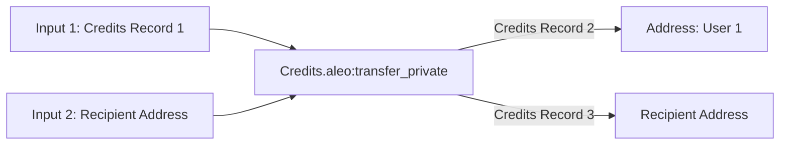
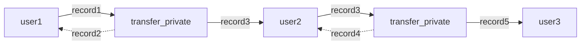

# Aleo SDK

## Tools for Building Zero Knowledge Web Apps

The Aleo SDK is a collection of JavaScript libraries for building zero knowledge web applications in both the browser
and node.js.

## Overview

Aleo provides the ability to run programs in zero knowledge. The Aleo SDK provides the tools to use these programs
within the browser and all other levels of the web stack to build privacy preserving applications.

The Aleo SDK provides the following functionality (Click to see examples):
1. [Aleo account creation and Aleo account data management](https://aleo.tools/account)
2. [Tools for executing, deploying, and interacting with zero knowledge programs in the browser](https://aleo.tools/develop)
3. [Management of program state and data](https://aleo.tools/record)
4. [Value Transfers](https://aleo.tools/transfer)
5. [Communication with the Aleo network](https://aleo.tools/rest)

## Installation

### NPM

To install the Aleo SDK from NPM run:

`npm install @aleohq/sdk` or `yarn add @aleohq/sdk`. 

### Build from source

To build the project from source, go to this project's root and execute:

`npm install && npm run build`

## Getting Started

### Zero Knowledge Web App Examples

A set of fully functional examples and accompying documentation for creating zero knowledge web apps can be found in 
[create-aleo-app](https://github.com/AleoHQ/sdk/tree/feat/create-aleo-app-alpha/create-aleo-app).

### Aleo.tools

Additionally, the SDK powers [aleo.tools](https://aleo.tools) - a React app that provides a graphical interface for most
of the functionality provided by the SDK and can be used as a reference for usage of the SDK. Source code for aleo.tools
can be found [in the SDK repo here](https://github.com/AleoHQ/sdk/tree/testnet3/website)

## Usage

## 1. Create an Aleo Account

The first step in operating a zero knowledge web application is creating a cryptographic identity for a user. In the
context of Aleo, this process starts by generating a private key. From this private key, cryptographic keys used to 
operate Aleo programs are derived.

These keys include:
#### Private Key
The key used to represent an identity of an individual user. This key is used to authorize zero 
knowledge program execution.
#### View Key
This key is derived from the private key and can be used to identify all records and transaction data that
belongs to an individual user.
#### Compute Key
A key that can be used to trustlessly run applications and generate transactions on a user's behalf.
#### Address
A public address that can be used to trustlessly identify a user in order for that user to receive official
aleo credits or unique data defined by other zero-knolwedge Aleo programs.

All of these keys can be created using the account object:
```typescript
import { Account } from '@aleohq/sdk';

const account = new Account();

// Individual keys can be then be accessed through the following methods
const privateKey = account.privateKey();
const viewKey = account.viewKey();
const address = account.address();
```

Please note that all keys are considered sensitive information and should be stored securely.

## 2. Run Aleo Programs

### 2.1 Aleo Programs

Aleo programs provide the ability for users to make any input or output of a program private and prove that the program
was run correctly. Keeping program inputs and outputs private allows developers to build privacy into their applications.

Zero Knowledge Aleo Programs are written in one of two languages: 
1. [Leo](https://developer.aleo.org/leo/language): A high level, developer friendly language for developing
zero knowledge programs.
2. [Aleo Instructions](https://developer.aleo.org/aleo/instructions): A low level language for defining zero knowledge
programs. Aleo Instructions provides developers with fine-grained control over their program execution. Programs that 
are written in Leo are compiled to Aleo instructions.

Documentation for both languages can be found at [developer.aleo.org](https://developer.aleo.org).

#### Hello world in the Leo Language 
```
program helloworld.aleo {
  transition hello(public a: u32, b: u32) -> u32 {
      let c: u32 = a + b;
      return c;
  }
}
```

#### Hello world in Aleo instructions
```
program helloworld.aleo;

// The leo code above compiles to the following Aleo instructions
function hello:
    input r0 as u32.public;
    input r1 as u32.private;
    add r0 r1 into r2;
    output r2 as u32.private;
```

### 2.2 Program Execution

The SDK provides the ability execute Aleo Instructions programs %100 client-side within the browser. 

The `ProgramManager` object encapsulates the functionality for executing programs and making zero knowledge proofs about
them. Under the hood it uses cryptographic code compiled from [SnarkVM](https://developer.aleo.org/aleo) into WebAssembly
in order to provide the ability to execute programs in zero knowledge fully within the browser without requiring any
external communication with the internet. Users interested in lower level details how this is achieved can visit the 
[aleo-wasm](https://github.com/AleoHQ/sdk/tree/testnet3/wasm) crate.

At the current time program execution is only supported in the context of web browsers. Program execution in NodeJS is not currently supported,
but account management, record management, and communication with the Aleo network can still be performed in NodeJS.

### 2.3 Local Program Execution
A simple example of running the hello world program locally is shown below:
```typescript
import { Account, Program } from '@aleohq/sdk';

/// Create the source for the "hello world" program
const program = "program helloworld.aleo;\n\nfunction hello:\n    input r0 as u32.public;\n    input r1 as u32.private;\n    add r0 r1 into r2;\n    output r2 as u32.private;\n";
const programManager = new ProgramManager();

/// Create a temporary account for the execution of the program
const account = new Account();
programManager.setAccount(account);

/// Get the response and ensure that the program executed correctly
const executionResponse = await programManager.executeOffline(program, "hello", ["5u32", "5u32"]);
const result = executionResponse.getOutputs();
assert(result === ["10u32"]);
```

### 2.4 Program execution on the Aleo Network
The SDK also provides the ability to execute programs and record that execution on the Aleo network. 

This process is somewhat involved, but can be thought of in 3 steps:

1. Running the program with specific inputs and outputs
2. Making a zero knowledge proof about the program execution
3. Posting the zero knowledge proof of program execution to the Aleo network along with any public inputs and outputs of
the program

This process of posting the execution to the Aleo Network serves as a globally trustless and verifiable record of the
program execution which can be provided to other parties as proof that a program was executed correctly. It also provides
a global record of any state changes made to either records or data stored on the Aleo network.

A simple example of running the hello world program on the Aleo network is shown below:
```typescript
import { Account, AleoNetworkClient, NetworkRecordProvider, ProgramManager, KeySearchParams} from '@aleohq/sdk';

// Create a key provider that will be used to find public proving & verifying keys for Aleo programs
const keyProvider = new AleoKeyProvider();
keyProvider.useCache = true;

// Create a record provider that will be used to find records and transaction data for Aleo programs
const networkClient = new AleoNetworkClient("https://vm.aleo.org/api");
const recordProvider = new NetworkRecordProvider(account, networkClient);

// Initialize a program manager to talk to the Aleo network with the configured key and record providers
const programName = "hello_hello.aleo";
const programManager = new ProgramManager("https://vm.aleo.org/api", keyProvider, recordProvider);

// Provide a key search parameter to find the correct key for the program if they are stored in a memory cache
const keySearchParams = { "cacheKey": "hello_hello:hello" };
const tx_id = await programManager.execute(programName, "hello_hello", 0.020, ["5u32", "5u32"], undefined, undefined, undefined, keySearchParams);
const transaction = await programManager.networkClient.getTransaction(tx_id);
```

A reader of the above example may notice a few extra classes that were not present in the local execution example. These
concepts are described below.

#### Program Proving Keys & Program Records

Executing Aleo programs in zero knowledge requires two additional pieces of information.

1. **Function Proving & Verifying Keys:** Proving and Verifying keys are cryptographic keys that are generated when a program is
   executed. These keys are public and unique for each program. The proving key allows any party to execute the program and
   generate a proof that the program was executed correctly. The verifying keys allow any party to verify that the proof
   was generated correctly and the execution is correct. These keys are required to create the zero knowledge property 
   of program execution.
2. **Program Records:** Records are private state generated by a program belonging to a unique private keyholder. Records
   are generated by a program's functions and can be changed and updated by when a user runs various functions of the 
   program. These records are private by default and are used to manage a long term private state. One of the most clear
   usages of records is to the `credits` record in the `credits.aleo`. Credits records are one of two official ways of 
   representing Aleo credits on the Aleo Network and are used to pay all transaction fees on
   the network.

For this reason, all programs will need proving and verifying keys to operate and many functions in Aleo programs will
require records as inputs. To simplify the process of managing keys and records, the SDK provides two abstractions
for managing these concepts:

1. **KeyProvider:** When programs execute, by default, they will synthesize the proving and verifying keys needed to
make a zero knowledge proof. However, these keys are large and expensive to generate. For this reason, applications may
want to store these keys and re-use them for future execution. The `KeyProvider` interface provides the ability for
users of the SDK to provide their own key storage and retrieval mechanism. The SDK provides a default implementation
of the `KeyProvider` interface via the `AleoKeyProvider` class. 
2. **RecordProvider:** When programs execute, they will often need to read and write records. The `RecordProvider` 
interface allows users of the SDK to provide their own record storage and retrieval mechanism. The SDK provides a
default implementation of the `RecordProvider` interface via the `NetworkRecordProvider` class which searches the Aleo
network for records uniquely belong to a user.

The `ProgramManager` class is capable of taking a `KeyProvider` and `RecordProvider` as arguments and will use them to
find the correct keys and records for a program execution.

### 2.5 Deploy a new Program to the Aleo Network

The Aleo Network contains a public registry of programs that can be executed by anyone. Any user can add an Aleo program
to the network (as long as it doesn't already currently exist) by paying a deployment fee in Aleo credits. The SDK
provides a simple interface for deploying programs to the Aleo network using the program manager.

```typescript
import { Account, AleoNetworkClient, NetworkRecordProvider, ProgramManager, KeySearchParams} from '@aleohq/sdk';

// Create a key provider that will be used to find public proving & verifying keys for Aleo programs
const keyProvider = new AleoKeyProvider();
keyProvider.useCache = true;

// Create a record provider that will be used to find records and transaction data for Aleo programs
const networkClient = new AleoNetworkClient("https://vm.aleo.org/api");
const recordProvider = new NetworkRecordProvider(account, networkClient);

// Initialize a program manager to talk to the Aleo network with the configured key and record providers
const programManager = new ProgramManager("https://vm.aleo.org/api", keyProvider, recordProvider);

// Define an Aleo program to deploy
const program = "program hello_hello.aleo;\n\nfunction hello:\n    input r0 as u32.public;\n    input r1 as u32.private;\n    add r0 r1 into r2;\n    output r2 as u32.private;\n";

// Define a fee to pay to deploy the program
const fee = 1.8; // 1.8 Aleo credits

// Deploy the program to the Aleo network
const tx_id = await programManager.deploy(program, fee);

// Verify the transaction was successful
const transaction = await programManager.networkClient.getTransaction(tx_id);
```

## 3. Value Transfers

### 3.1 Transferring Aleo Credits
Within the program manager is the ability to transfer aleo credits between users. This is done by using the `transfer` 
function within the `ProgramManager`. This function executes the credits.aleo under the hood.

There are two ways to hold credits on the Aleo network. The first is maintaing a `credits` record - the second
is by holding a `balance` in the `account` mapping in the `credits.aleo` program on chain. More about records and mappings
are explained in the [Managing Records and Private State](#4-managing-records-and-private-state) section below. But in 
short there are four transfer functions available.

* `transfer_private` - Takes a `credits` record of owned by the sender, subtracts an amount from it, and adds that amount
to a new record owned by the receiver. This function is %100 private and does not affect the `account` mapping.
* `transfer_public` - Subtracts an amount `credits` stored in the `account` mapping of the `credits.aleo program`, and 
adds that amount to the `account` mapping of the receiver. This function is %100 public and does not consume or generate
any records.
* `transfer_private_to_public` - Takes a `credits` record of owned by the sender, subtracts an amount from it, and adds
that amount to the `account` mapping of the receiver. This function is %50 private and %50 public. It consumes a record
as a private input and generates a public balance in the `account` mapping entry belonging to the receiver.
* `transfer_public_to_private` - Subtracts an amount `credits` stored in the `account` mapping of the `credits.aleo program`
and adds that amount to a new private record owned by the receiver. This function is %50 private and %50 public. 
It publicly consumes a balance in the `account` mapping entry belonging to the sender and generates a private record
as a private output.

All four of these functions can be used to transfer credits between users via the `transfer` function in the `ProgramManager`

```typescript

### 3.2 Splitting and Joining Records

### 3.3 Checking a public balanace

## 4. Managing Records and Private State

### 3.1 Private State Data: Records
Records in are analogous to concept of [UTXOs](https://en.wikipedia.org/wiki/Unspent_transaction_output). When a record is
created by a program, it can then be consumed later by the same program as an input to a function. Once a record is used
as input, it is considered consumed and cannot be used again. In many cases a new record will be created from the output
of the function. Records are private by default and are associated with a single Aleo program and a single private key
representing a user.

### 3.2 Record Usage Example: Private Value Transfers

A straightforward example of a usage of records in a program can be demonstrated by explaining the process of private
value transfers of official Aleo credits on the Aleo network.

Aleo credits are the official token in which all on-chain execution and deployment fees are paid. Credits can be public 
or private. Private credits are represented by the `credits` record in the [credits.aleo](https://www.aleo.network/programs/credits.aleo)
program.

```
record credits:
    owner as address.private;
    microcredits as u64.private;
```

Credits records contain an `owner` field representing the address which owns the record and a `microcredits` field 
representing the amount of microcredits in the record. 1 credit is equal to 1,000,000 microcredits.

An example of an Aleo function that both takes a record as input and outputs a record is the `transfer_private` function
of the `credits.aleo` program. This function takes a private `credits` record as input and outputs two new private `credits`
records as output (one that sends the credits to the recipient and one that sends the remaining credits to the sender).

The source code for the `transfer_private` is:
```
function transfer_private:
    input r0 as credits.record;
    input r1 as address.private;
    input r2 as u64.private;
    sub r0.microcredits r2 into r3;
    cast r1 r2 into r4 as credits.record;
    cast r0.owner r3 into r5 as credits.record;
    output r4 as credits.record;
    output r5 as credits.record;
```

Which can be graphically represented by the following graph:


If a program execution transaction is submitted to the Aleo Network which consumes or outputs a record, the encrypted 
record output will be posted to the Aleo network and will be associated with the transaction ID of the program execution.

Because the records are encrypted when they're posted on the network, they do not reveal any information about the party
who executed the program, nor the contents of the record. The only information that is revealed is the program ID, 
function name, encrypted function inputs, and the transaction ID of the program execution. No user except for the recipient
of the record can see the contents of the record. 

<details>
<summary>Example On-Chain record</summary>
An example of the data generated by the private execution of the `transfer_private` function of the `credits.aleo` 
program that is posted to the Aleo Network is shown below.

```json
  "transactions": [
    {
      "status": "accepted",
      "type": "execute",
      "index": 0,
      "transaction": {
        "type": "execute",
        "id": "at1s7dxunms8xhdzgaxrwf0yvq2dqgxtf4a3j8g878rhfr0zwhap5gqywsw8y",
        "execution": {
          "transitions": [
            {
              "id": "as1thy8fvkz0rkls5wnmfq5udrcvvzurq7mqk8pkhjf63htqjf9mugqp0mfhd",
              "program": "credits.aleo",
              "function": "transfer_private",
              "inputs": [
                {
                  "type": "record",
                  "id": "1406044754369042876058586523429806531093330762697573675195902502647806778955field",
                  "tag": "242626059121157295593694555515381893342956813170338731374395259242800138642field"
                },
                {
                  "type": "private",
                  "id": "1533599744296862879610225011439684001995294756698105572984689232395187168232field",
                  "value": "ciphertext1qgqgpu7m8p0rwjahwffyvm4g4n6903d6ufqty74z4504w4rn356hgp9jvpuvx8suu0pukr3sl7n8x65dz35nu4jdy4lgcguxldygufrfpyqd6xr5"
                },
                {
                  "type": "private",
                  "id": "4081557229261486898857101724786348855190759711760925564309233047223407640812field",
                  "value": "ciphertext1qyqxd9wue0qh8hs6dgevn7zleedfkzf7pft8ecked2xq3pw54pgqzyqr69sgx"
                }
              ],
              "outputs": [
                {
                  "type": "record",
                  "id": "1388064668770056715587596299070268626507043043686185311840561493640415146425field",
                  "checksum": "5376939704883651492329501631722578074516322228314928758786996843926470523116field",
                  "value": "record1qyqsq4r7mcd3ystjvjqda0v2a6dxnyzg9mk2daqjh0wwh359h396k7c9qyxx66trwfhkxun9v35hguerqqpqzqzshsw8dphxlzn5frh8pknsm5zlvhhee79xnhfesu68nkw75dt2qgrye03xqm4zf5xg5n6nscmmzh7ztgptlrzxq95syrzeaqaqu3vpzqf03s6"
                },
                {
                  "type": "record",
                  "id": "4635504195534945632234501197115926012056789160185660629718795843347495373207field",
                  "checksum": "3428805926164481449334365355155755448945974546383155334133384781819684465685field",
                  "value": "record1qyqsp2vsvvfulmk0q0tmxq7p9pffhfhha9h9pxsftujh57kkjuahx9s0qyxx66trwfhkxun9v35hguerqqpqzq8etfmzt2elj37hkf9fen2m2qes8564sr8k970zyud5eqmq7ztzq5r3095mkfdzqzz7yp6qfavqsl3t22t6dvgauqqt2xqk98zwmtusq5ck7fm"
                }
              ],
              "tpk": "5283803395323806407328334221689294196419052177553228331323093330938016699852group",
              "tcm": "4398026033398688325681745841147300822741685834906186660771751747897598751646field"
            }
          ],
```
</details>

If a user receives a private record from a program execution or generates one themselves in ciphertext, they can use the
SDK to decrypt encrypted records with their view keys and view their contents. Note that only records that are owned by
the user can be decrypted. Decryption of records that are not owned by the user will fail.

Record decryption and ownership verification can be done in the SDK using the following code:

```typescript
import { Account, RecordCiphertext, RecordPlaintext } from '@aleo/sdk';

// Create an account from an existing private key
const account = Account.from_string({privateKey: "existingPrivateKey"});

// Record value received as a string from program output or found on the Aleo network
const record = "record1qyqsq4r7mcd3ystjvjqda0v2a6dxnyzg9mk2daqjh0wwh359h396k7c9qyxx66trwfhkxun9v35hguerqqpqzqzshsw8dphxlzn5frh8pknsm5zlvhhee79xnhfesu68nkw75dt2qgrye03xqm4zf5xg5n6nscmmzh7ztgptlrzxq95syrzeaqaqu3vpzqf03s6";

const recordCiphertext = RecordCiphertext.fromString(record);

// Check ownership of the record. If the account is the owner, decrypt the record
if (RecordCiphertext.is_owner(account.viewKey())) {
   // Decrypt the record with the account's view key
   const recordPlaintext = recordCiphertext.decrypt(account.viewKey());

   // View the record data
   console.log(recordPlaintext.toString());
}
```

What the above process allows is a private chain of state to be created between multiple users. In the context of value
transfers, a chain of state might look like the following:



The above state chain would be executed in the following way using the SDK:
#### Step 1 - User 1 sends a private value transfer to User 2
```typescript
// USER 1
import { Account, ProgramManager, AleoKeyProvider, NetworkRecordProvider, AleoNetworkClient } from '@aleo/sdk';

// Create a new NetworkClient, KeyProvider, and RecordProvider
const account = Account.from_string({privateKey: "user1PrivateKey"});
const networkClient = new AleoNetworkClient("https://vm.aleo.org/api");
const keyProvider = new AleoKeyProvider();
const recordProvider = new NetworkRecordProvider(account, networkClient);

// Initialize a program manager with the key provider to automatically fetch keys for executions
const USER_2_ADDRESS = "user2Address";
const programManager = new ProgramManager("https://vm.aleo.org/api", keyProvider, recordProvider);
programManager.setAccount(account);

/// Send private transfer to user 2
const tx_id = await programManager.transfer(1, USER_2_ADDRESS, "transfer_private", 0.2);
```

#### Step 2 - User 2 receives the transaction ID and fetches the record from the network to send to user 3
```typescript
// USER 2
import { Account, ProgramManager, AleoKeyProvider, NetworkRecordProvider, AleoNetworkClient } from '@aleo/sdk';

// Create a new NetworkClient, KeyProvider, and RecordProvider
const account = Account.from_string({privateKey: "user2PrivateKey"});
const networkClient = new AleoNetworkClient("https://vm.aleo.org/api");
const keyProvider = new AleoKeyProvider();
const recordProvider_User2 = new NetworkRecordProvider(account, networkClient);

// Initialize a program manager with the key provider to automatically fetch keys for executions
const programManager = new ProgramManager("https://vm.aleo.org/api", keyProvider, recordProvider);
programManager.setAccount(account);

// Fetch the transaction from the network that user 1 sent
const transaction = await programManager.networkClient.getTransaction(tx_id);
const record = <string>transaction.execution.transitions[0].outputs[0].value;

// Decrypt the record with the user's view key
const recordCiphertext = <RecordCiphertext>RecordCiphertext.fromString(record);
const recordPlaintext = <RecordPlaintext>recordCiphertext.decrypt(account.viewKey());

// Send a transfer to user 3 using the record found above
const USER_3_ADDRESS = "user3Address";
const tx_id = await programManager.transfer(1, USER_3_ADDRESS, "transfer_private", 0.2, undefined, recordPlaintext);
```

### 3.3 Public State Data: Mappings
Mappings are simple key value stores defined in a program. They are represented by a key and a value each of a specified
type. They are stored directly within the Aleo blockchain and can be publicly read by any participant in the Aleo network.

An example of a mapping usage is `account` mapping in the `credits.aleo` program.
```
mapping account:
    key owner as address.public;
    value microcredits as u64.public;
```

The `account` mapping is used to store public credits balances on the Aleo network. It takes a public address as a key
and a public u64 value representing the number of microcredits owned by the address.

### 3.4 Mapping Usage Example: Public Value Transfers

The official way for paying for program executions and deployments on the Aleo network is Aleo credits. The SDK


Each credits record is simple


```typescript
```


## 4. Communicate with the Aleo Network


## Documentation

API documentation for this package can be found on the [Aleo Developer Hub](https://developer.aleo.org/sdk/typescript/overview).

To view the documentation locally, open `docs/index.html`. To regenerate the documentation, run `npx jsdoc --configure jsdoc.json --verbose`

## Usage

This SDK is used to power [Aleo.tools](https://aleo.tools/develop). Aleo.tools is open source and can be used as a
reference for how to use the SDK to build your own zero knowledge web app.

Sources can be found here: https://github.com/AleoHQ/sdk/tree/testnet3/website

You can visit the [SnarkVM repo](https://github.com/AleoHQ/snarkVM) and [SnarkOS repo](https://github.com/AleoHQ/snarkOS)
if you're interested in learning more about the architecture that powers the Aleo SDK.
